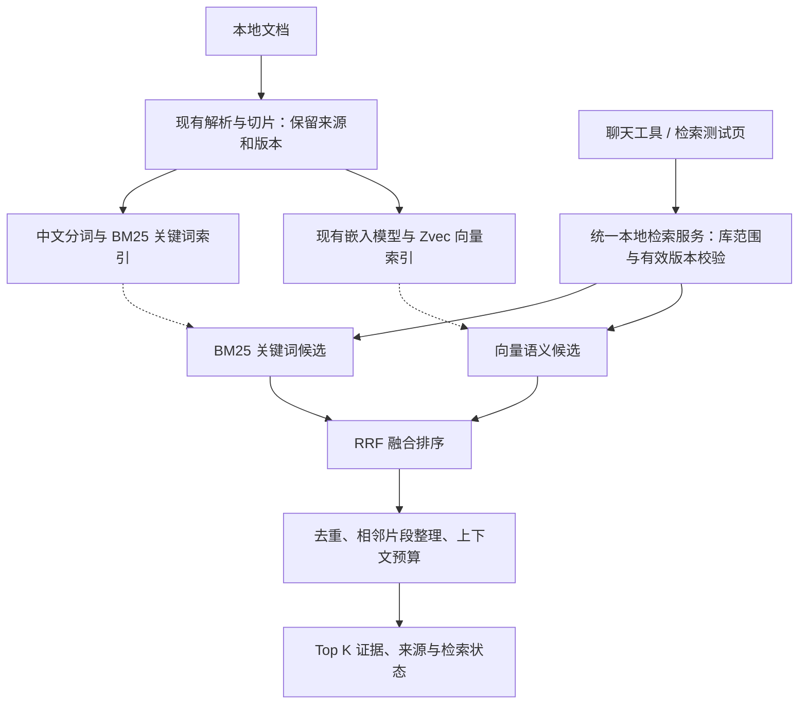

# 本地知识库 BM25＋向量检索＋RRF 实施计划

日期：2026-09-14  
状态：方案已确认，本文是实施计划；本次仅编写文档，尚未实施代码变更。  
目标仓库：`D:/python/projects/Fox/Fox`  
核对基线：HEAD `8c003ae` 及当前工作区源码；仓库存在其他进行中的改动，实施前必须重新核对。

## 1. 目标与范围

把本地知识库的聊天查询和检索测试入口统一为同一个检索服务，提供 BM25 关键词召回、现有 Zvec 向量召回和 RRF 融合排序，并保留原文证据与来源定位。

- 仅优化 `source = local` 的知识库查询。远程仍由 Yuxi 后端查询并返回结果，Fox 不改其检索算法、不重新排序远程结果。
- 不引入知识图谱、图数据库、独立重排模型、自动查询改写或项目文件夹搜索。
- 复用现有文档解析、切片、知识库绑定、嵌入模型及 Zvec 向量存储。第一阶段不重构 PDF、Office 解析器或整体切片算法。
- 借鉴 zvec-grep 的 BM25＋向量＋RRF 检索组织方式，不要求把它的 Node 服务、模型下载器或整套索引管理直接打包进 Fox。
- 保留 `keyword`、`vector`、`hybrid` 模式；聊天默认遵循知识库配置，不擅自把已有纯关键词库改成需要嵌入模型的混合库。

## 2. 已核对的现状

| 部位 | 当前行为 | 本次需要解决的问题 |
| --- | --- | --- |
| 聊天 `search_knowledge` 本地分支 | 调用 `search_lexical` | 尚未使用已有向量和 RRF 混合检索 |
| 本地关键词检索 | SQLite 子串匹配；按更新时间先取最多 2,000 个候选，再使用自定义评分 | 中文不分词；候选提前按时间截断；缺少 BM25 排序 |
| 自定义关键词分数 | 70% 查询词覆盖率＋30% 归一化出现次数，每词最多计 3 次 | 不是 BM25，未考虑词语稀有度及片段长度归一化 |
| 检索测试入口 | 支持关键词、向量和混合模式；混合使用等权 RRF，k=60 | 与聊天入口行为不同，关键词侧仍逐切片评分 |
| 现有基础 | SQLite、原文切片、来源元数据、本地嵌入和 Zvec 已有实现 | 优先复用，避免建立两套文档和向量管理体系 |

源码定位线索（行号可能随并行工作变化）：

- [聊天查询本地与远程路由](D:/python/projects/Fox/Fox/apps/desktop/src-tauri/src/runtime_host/mod.rs:7537)
- [当前关键词查询](D:/python/projects/Fox/Fox/apps/desktop/src-tauri/src/local_knowledge.rs:1709)
- [当前分词和关键词评分](D:/python/projects/Fox/Fox/apps/desktop/src-tauri/src/local_knowledge.rs:3607)
- [现有混合检索与 RRF](D:/python/projects/Fox/Fox/apps/desktop/src-tauri/src/local_knowledge_vector.rs:2006)
- [检索测试客户端入口](D:/python/projects/Fox/Fox/apps/desktop/src/features/conversations/api/desktop-client.ts:761)

历史产品文档有“Embedding 后续接入”等旧描述，不能用它覆盖上述当前源码事实。本次不顺带改写历史文档。

## 3. 目标架构与实现决策

### 3.1 关键词索引

优先使用现有 SQLite 的 FTS5/BM25，在本地知识存储边界内维护索引。先验证 Fox 实际打包的 SQLite 支持 FTS5，以及 Windows 构建、中文分词和增量维护可行，再落实索引模块。

- 文档与查询使用一致的中文分词、英文规范化和业务词典版本；保留设备编号、缩写、数字及必要的完整标识符。词典变更触发关键词索引版本更新。
- 分词结果作为索引数据保存，原文、页码、段落和偏移不因分词改变。展示与引用必须回读原始切片，不能把分词文本当作正文。
- 使用倒排索引按相关性取候选，移除聊天入口按更新时间截取 2,000 条再评分的常规路径。
- FTS 查询语法由程序构造并转义；不能把用户问句直接当作 MATCH 表达式执行。
- SQLite FTS5 的 BM25 原始分数越小越相关，按升序转成排名后进入 RRF；不能沿用旧评分的降序规则。
- 库范围、有效文档版本必须在候选截断前约束。阶段一明确 BM25 语料统计的作用域：若采用共享 FTS 表，记录其跨库统计影响并测试；不能误称为每库独立 IDF，也不能让其他库候选挤占本库名额。
- 分词库选择轻量的 Rust 实现，核验许可证、词典体积与 Windows 支持，不为关键词检索新增模型服务。

### 3.2 召回与融合

- `keyword`：只执行 BM25；`vector`：只执行现有向量检索；`hybrid`：融合两路候选。
- 第一版沿用等权 RRF：`1/(60+关键词名次) + 1/(60+向量名次)`；某路缺席贡献 0，名次从 1 开始。
- 候选数量初值沿用现有向量策略：每路 `clamp(8 × TopK, 20, 200)`，默认 TopK=8 时每路 64 条。这是待验证初值，不是已证明的最优参数。
- 在各自有序候选中按稳定切片身份去重，再计算排名。最终并列使用稳定标识排序，避免重复查询无故换序。
- 两路使用同一知识库、有效文档版本及切片身份；必须能发现并明确报告索引落后或不匹配，不能混合新旧正文。
- 先融合再按预算读取与整理少量原文，避免常规查询把整个知识库正文加载到内存。
- 不跨文档合并片段；相邻片段只有来源、版本和位置连续时才可整理，并保留每段引用。
- 无模型的纯关键词库仍可用；配置为向量／混合但依赖不可用时，沿用明确报错或状态提示，第一版不新增静默降级。

### 3.3 统一服务与兼容

聊天和检索测试页共同调用同一个本地服务。同一知识库、版本、模式、TopK 与字符预算应产生相同的有序切片和来源。测试页的显式模式用于试验，不修改库配置。

保留既有知识库绑定校验、`topK`／`maxChars` 约束及 `documentId`、`chunkId`、来源元数据、页码／幻灯片／段落定位。内部统一结果后由现有入口适配外部响应形状，避免破坏聊天和预览消费者。

可增加向后兼容的实际检索模式、索引版本、分路排名、RRF 版本及阶段耗时，用于诊断。RRF 分数不是置信度，不展示为“准确率”。多库请求继续按来源返回，不进行本地与 Yuxi 结果的二次混排。

## 4. 实施阶段

| 阶段 | 主要工作 | 阶段完成条件 |
| --- | --- | --- |
| 1. 基线与接口 | 检查 Git/WIP；核对当前调用链；建立新旧结果和性能基线；确定统一服务契约；验证 FTS5 与分词方案 | 留存基线、固定评测集和接口说明；索引原型证明中文、编号及排序方向正确 |
| 2. BM25 与索引生命周期 | 建立索引和版本记录；接入新增、修改、重新解析、删除与存储迁移；增量更新、首次回填、可恢复重建 | 旧库无需重新导入；更新／删除后无失效结果；中断重启可恢复；仅在索引完整就绪后启用新路径 |
| 3. 统一本地检索服务 | 复用现有向量执行边界；接入 BM25、受限候选与 RRF；统一元数据和资源预算 | 三种模式可独立测试；范围、版本、顺序、引用和预算均可验证 |
| 4. 接通产品入口 | 聊天本地分支与测试页接入统一服务；仅补齐必要状态展示 | 相同参数下两入口的有序切片一致；聊天实际获得混合检索结果并可打开来源；远程契约不变 |
| 5. 质量、性能与回退验收 | 跑固定评测、索引故障用例、实际桌面问答；测耗时、内存、磁盘与安装包增量；验证切回旧路径 | 下列验收项通过；未执行项目明确列出；形成可复查结果报告 |

执行顺序：阶段 1 → 2 → 3 → 4 → 5。每阶段通过相关检查后继续，不把测试页通过当成聊天已接通。

### 数据迁移与回退要求

- 新增迁移必须兼容当前并行开发中的 schema，不复用或覆盖他人尚未提交的迁移编号。
- 使用当前受管切片回填，不删除用户原文、不重新导入知识库、不默认重建已有效的向量索引。
- 原链路在首次回填期间继续服务；新索引完整就绪后再切换。重建失败或应用重启不能暴露半成品索引。
- 导入／修改／删除与索引维护必须事务一致，或通过可恢复任务和版本过滤保证可见性；需覆盖重命名、重新解析及存储迁移。
- 保留内部切换机制用于回到旧查询路径；回退不要求删除知识库或逆向破坏 schema，并明确实际检索模式。

## 5. 验收标准

### 检索质量与实际使用

建立至少 30 条固定问题，覆盖中文无空格问句、业务词、设备编号、中英混排、同义表达、长短片段、跨文档相关内容和无命中问题。标注相关文档／切片及可核对原文；划分调参与最终验证问题，避免只调到测试样例通过。

对照“当前聊天关键词”“当前测试页混合”“新 BM25”“新混合”四种配置，记录 Recall@8、nDCG@8 和代表性失败样例。比较时固定资料版本、嵌入模型和查询参数。通过门槛：关键编号与权限用例全部通过，整体指标不低于现有基线，中文／同义表达子集有可复查改善；未达标则先分析，不宣称优化完成。

必须在 Fox 桌面实际执行至少三类问答：精确编号查询、中文自然语言查询、同义表达查询。核对工具输入、实际检索模式、结果切片、最终引用和原文打开；仅模拟工具返回不算真实验收。

### 正确性与边界

- 未绑定知识库不可检索；其他库内容不能进入候选或结果。
- 更新后旧版本不返回，删除后结果消失；文档复制、去重或片段合并不丢来源。
- 超过旧的 2,000 条候选规模时，较旧但相关的文档仍有机会按相关性进入结果。
- 单路无命中、两路无命中、重复候选、并列名次、TopK 和字符预算边界正确。
- 验证 BM25 分数方向、RRF 名次起点与缺席规则、分词前后定位一致性。
- 验证索引中断／恢复、部分失败、旧库升级、存储迁移、模型或向量索引不可用。
- 使用固定远程接口响应回归 Yuxi 分支，确认请求与返回结果未被新排序改变。

### 性能与资源

至少使用 1,000 和 10,000 个有效切片，按同一机器、资料与模型分别记录冷启动、热查询 P50/P95、进程树峰值内存、首次建索引、增量更新、索引磁盘和 Windows 安装包增量。分开报告关键词、向量和融合时间，不把模型冷加载误算为 BM25 开销。

建议性能门槛：同条件热混合查询 P95 相比现有混合入口回退不超过 20%；若超出，定位并解决或明确解释待决取舍。该阈值是实施验收目标，不是本轮实测结果。新的常规查询不得依赖全库正文加载；长时间索引不得阻塞桌面交互。

单元／数据库测试、真实本地嵌入测试、Fox 桌面实际问答、Windows 打包、跨机器验证分别报告。缺少模型或环境的项目标“未执行／待验收”，不能以模拟测试替代。执行相关测试与构建，不为本次任务泛化清理仓库或扩展无关测试。

## 6. 最终交付

1. 实现代码、必要的索引迁移与内部回退机制。
2. 固定问题集、期望来源及新旧检索结果表。
3. 中文分词／词典、索引结构与版本、统一服务契约的简要说明。
4. 检索质量、性能、内存、磁盘与安装包增量报告，附测量环境。
5. 实际桌面问答和来源定位验证记录；尚未验证的边界单列。
6. 修改文件清单与 Git 状态；提交、推送、发布分别报告，不把本地完成视为已上线。

## 7. 给实施智能体的提示词

你负责在 `D:/python/projects/Fox/Fox` 实施本地知识库检索优化。先完整阅读本文件，按五个阶段推进实现与验收。

范围仅限本地知识库：使用 BM25 关键词召回＋现有 Zvec 向量召回＋等权 RRF（k=60）融合排序，支持中文分词、业务词和完整编号；统一聊天 `search_knowledge` 本地分支与检索测试页的服务入口。保留三种检索模式、库绑定与版本校验、TopK／字符预算及完整来源定位。

关键现状请重新核实：聊天本地分支目前调用 `search_lexical`，是子串匹配和自定义评分；已有混合检索位于 `local_knowledge_vector.rs`，主要由检索测试入口使用。不要把测试页支持混合检索当成聊天已接通。

优先复用 SQLite FTS5 做 BM25、现有解析切片和嵌入／Zvec 存储，借鉴 zvec-grep 的检索设计。不引入知识图谱、独立重排模型或项目目录搜索，不修改 Yuxi 远程查询与远程结果排序，不无条件打包 zvec-grep 的独立服务。索引回填与重建可恢复，更新和删除保持版本一致；不删除原文、不清空现有知识库，不静默降级或伪报索引就绪。

先检查仓库规则、Git 状态和现有调用链，优先用 codebase-memory 定位，再读关键源码确认。仓库可能有其他任务的改动；不要覆盖、回退、全量暂存或清理它们。记录基线并建立固定评测集，然后逐阶段完成代码、迁移、聚焦测试和桌面验证；一般实现选择自行处理，只有确实阻塞或超出范围才提出明确问题。

完成后给出修改清单、测试结果、新旧 Recall@8／nDCG@8、分阶段耗时与资源增量、真实 Fox 问答和来源定位证据、回退方法及未验证项。区分静态检查、模拟测试、真实模型、桌面验证、打包和跨机器验收；默认不提交、不推送、不发布。

## 8. 参考依据

- [zvec-grep 架构：BM25、向量与 RRF](https://github.com/zvec-ai/zvec-grep/blob/main/docs/05-architecture.md)
- [zvec-grep 提取与索引边界](https://github.com/zvec-ai/zvec-grep/blob/main/docs/04-pipeline.md)
- [SQLite FTS5：BM25 分数方向](https://www.sqlite.org/fts5.html#the_bm25_function)
- [SQLite FTS5：外部内容索引一致性](https://www.sqlite.org/fts5.html#external_content_tables)

外部项目文档证明机制与接口能力；Fox 的当前行为以上述源码为依据。本文的候选数量与性能门槛是实施初值及验收目标，不是已经取得的收益。
