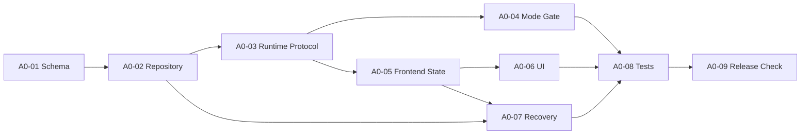

# Milestone：A0-Minimal-Work-Loop

> GitHub Milestone：[A0-Minimal-Work-Loop](https://github.com/Hry1729/Fox-Agent/milestone/1)
>
> 详细规格：`docs/FOX_AGENT_A0_SPECIFICATION.md`

## Milestone 目标

交付可恢复、可追溯的最小 `Goal -> Task -> Evidence` 工作闭环，并证明它不会干扰普通问答。

## Issue 清单

### [A0-01 数据模型与迁移](https://github.com/Hry1729/Fox-Agent/issues/1)

**范围**

- 新增 `goals`、`work_tasks`、`task_evidence`。
- 为 Run/Event/Tool Call 增加可空 Trace 字段。
- 建立必要索引、唯一约束和状态 Check。

**验收**

- 当前数据库可升级。
- 同一会话不能出现两个 active Goal。
- 完成 Task 缺少 Evidence 时 Repository 拒绝提交。
- 迁移测试和备份恢复测试通过。

**依赖**：无。

### [A0-02 Repository 与状态机服务](https://github.com/Hry1729/Fox-Agent/issues/2)

**范围**

- Goal/Task/Evidence CRUD。
- 乐观版本控制和合法状态转换。
- Evidence 多态引用校验与有效性更新。

**验收**

- 所有合法转换有测试。
- 非法跳转、跨会话引用和重复 Evidence 被拒绝。
- SQLite busy 使用有界重试。

**依赖**：A0-01。

### [A0-03 Runtime Host Tools 与事件协议](https://github.com/Hry1729/Fox-Agent/issues/3)

**范围**

- 实现 A0 Host Tools。
- 扩展 Capability Manifest。
- 定义版本化 Goal/Task/Evidence Event。

**验收**

- Runtime 无法绕过 Host 直接改状态。
- 重复 Event 不产生重复记录。
- 未支持 A0 的 Runtime 自动降级为普通会话。

**依赖**：A0-02。

### [A0-04 工作模式门控](https://github.com/Hry1729/Fox-Agent/issues/4)

**范围**

- 实现复杂任务确定性门控。
- 支持 Runtime 提议 Goal，但由 Host 决策。
- 对含糊和高风险任务请求用户确认。

**验收**

- 跨文件修复进入工作模式。
- 简单解释和一次性只读问题不创建 Goal。
- 用户明确“暂不修改”时不创建 Goal。

**依赖**：A0-03。

### [A0-05 前端状态归并与恢复](https://github.com/Hry1729/Fox-Agent/issues/5)

**范围**

- Goal 快照查询。
- Event Reducer 合并实时事件。
- 去重、乱序、刷新和重启恢复。

**验收**

- 乐观消息、工作过程和最终回复继续流式显示。
- 刷新前后 Goal/Task/Evidence 一致。
- 旧事件和未知事件不会让页面崩溃。

**依赖**：A0-03。

### [A0-06 工作闭环 UI](https://github.com/Hry1729/Fox-Agent/issues/6)

**范围**

- 当前 Goal 摘要、Task 计数和展开列表。
- Evidence 摘要及详情跳转。
- blocked、interrupted、stale、missing 状态。

**验收**

- 简单问答 UI 无额外负担。
- 回复结束后工作过程仍保留。
- 用户能从 Task 定位到工具、文件、测试或确认消息。

**依赖**：A0-05。

### [A0-07 中断恢复与 Evidence 校验](https://github.com/Hry1729/Fox-Agent/issues/7)

**范围**

- App 启动时审计非终态 Task。
- Sidecar 崩溃、Run 超时和用户取消传播。
- 文件、Artifact、测试和外部引用有效性校验。

**验收**

- 中断 Task 不会被标记完成。
- 旧 Evidence 失效后保留历史并显示原因。
- 重试增加 attempt，不覆盖旧 Evidence。

**依赖**：A0-02、A0-05。

### [A0-08 自动化测试与真实任务验收](https://github.com/Hry1729/Fox-Agent/issues/8)

**范围**

- 数据迁移测试。
- 状态机转换测试。
- Reducer 乱序/重复测试。
- 跨三文件 Bug 修复端到端测试。
- 普通问答负向测试。

**验收**

- `FOX_AGENT_A0_SPECIFICATION.md` 的完成定义全部通过。
- 失败矩阵关键路径均有测试或记录明确的人工验证结果。

**依赖**：A0-01 至 A0-07。

### [A0-09 文档、诊断与发布检查](https://github.com/Hry1729/Fox-Agent/issues/9)

**范围**

- 更新数据库 Schema、Runtime 协议和 Event Schema。
- 记录性能基线和已知限制。
- 准备 Alpha 验收清单和回滚说明。

**验收**

- 文档与代码中的枚举和字段一致。
- Alpha 包可从 A0 前数据库升级。
- 回滚步骤经过实际演练。

**依赖**：A0-08。

## 推荐执行批次

可并行点：A0-04 与 A0-05；A0-06 与 A0-07 在接口冻结后可并行。

## Milestone 退出条件

- A0-01 至 A0-09 全部关闭。
- 跨三文件 Bug 修复场景通过。
- 普通问答负向场景通过。
- 重启、崩溃和 Evidence 失效场景通过。
- Migration、数据完整性、性能基线和回滚演练有记录。
