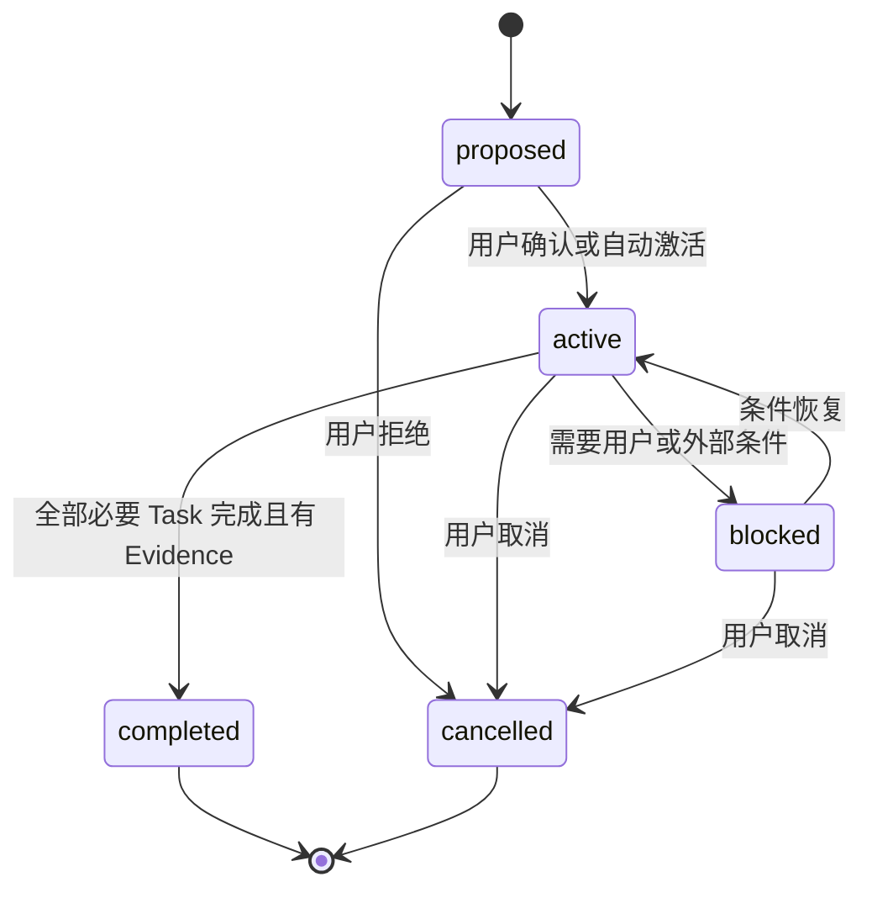
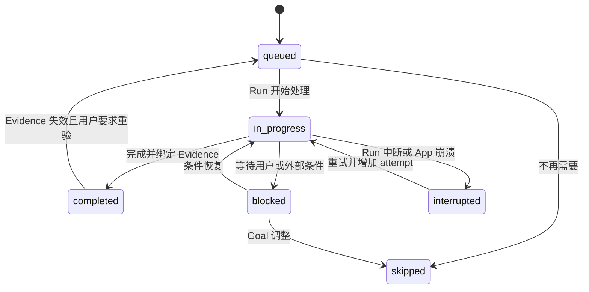

# Fox Agent A0 最小工作闭环规格

> 状态：已归档；A0 已实现，当前事实以架构、协议和测试为准<br>
> 适用版本：Fox `0.1.x`<br>
> 维护范围：A0 Goal、Task、Evidence 最小闭环<br>
> 最后更新：2026-08-24
>
> Milestone：`A0-Minimal-Work-Loop`<br>
> 目标：用最小的 `Goal -> Task -> Evidence` 闭环验证 Fox 的结构化工作模式，不提前引入 Plan 版本化、Review、Acceptance、Memory 或子 Agent。

## 1. 为什么先做 A0

原 A1 同时包含 Goal、PlanRevision、WorkTask、TaskEvidence、ReviewFinding 和 Acceptance 六层。它的最终方向正确，但首个交付面过大，会让数据模型、Runtime 协议、恢复逻辑和 UI 同时进入高风险改造。

A0 只验证三个核心假设：

1. Fox 能否区分简单问答和需要持续推进的复杂任务。
2. 复杂任务能否被拆成可恢复的 Task，并由 SQLite 保存真实状态。
3. Task 的完成能否由工具、文件和测试 Evidence 支撑，而不是只依赖模型声明。

A0 成功后，A1 再增量加入 PlanRevision、独立 Review 和 Acceptance，不推翻 A0 数据。

## 2. 范围

### 2.1 A0 包含

- 一个会话最多一个 active Goal，可保留历史 Goal。
- Goal 下的有序 Task 列表。
- Task 状态更新、阻塞、重试和中断恢复。
- Task 与 Tool Call、File Diff、Test Result、Artifact、用户确认等 Evidence 的关联。
- Evidence 有效性状态和重新校验入口。
- Run、Tool Call 和 Evidence 预埋 `trace_id`、`span_id`。
- App 重启后的 Goal、Task、Evidence 恢复。
- 对话工作过程中的最小 UI 展示。
- 数据迁移、恢复和核心状态转换自动化测试。

### 2.2 A0 不包含

- PlanRevision、计划审批和计划历史。
- ReviewFinding、独立 Reviewer 和 Acceptance。
- 长期 Memory。
- 会话 fork/archive/trash 的完整产品逻辑。
- 完整 Run Span 树、评估数据集和诊断产品。
- Child Run、Worker Pool 或任何并发子 Agent。
- OpenAPI、HTTP MCP 和 Hooks。

## 3. 真实验收场景

### 3.1 主验收任务

让 Fox 修复一个跨三个文件的可复现 Bug，例如：

- 一个状态模型或数据访问文件；
- 一个 Runtime/业务逻辑文件；
- 一个前端展示或测试文件。

必须满足：

1. Goal 自动创建，或在任务含糊/高风险时由用户确认后激活。
2. 至少生成三个 Task：定位、修改、验证。
3. 每个完成的 Task 至少绑定一条 Evidence。
4. 修改 Task 至少绑定 `file_diff` 或 `artifact` Evidence。
5. 验证 Task 至少绑定 `test_result` 或 `tool_call` Evidence。
6. App 重启后仍能查看 Task 状态、尝试次数和 Evidence。
7. 中断的 Task 不会被错误显示为完成。

### 3.2 负向验收任务

以下请求不得自动创建 Goal：

- “解释这个函数做什么。”
- “现在几点？”
- “列出这个目录的文件。”
- 不需要持续状态的一次性知识问答。

## 4. 工作模式门控

A0 使用确定性规则与 Runtime 建议相结合，但最终状态由 Fox Host 决定。

### 4.1 直接进入工作模式

满足任一条件时可自动创建 active Goal：

- 用户明确要求实现、修复、重构、迁移、构建或验证，并预计涉及多个步骤。
- 预计修改两个及以上文件。
- 需要修改后运行测试或构建。
- 用户明确要求创建任务、计划或持续跟进。

### 4.2 先请求用户确认

- 目标或验收条件含糊。
- 涉及破坏性操作、高风险权限或大范围修改。
- Runtime 建议创建 Goal，但确定性规则无法确认是复杂任务。

### 4.3 保持普通对话

- 解释、摘要、检索和一次性只读问题。
- 单次工具调用即可可靠完成，且不需要跨重启恢复。
- 用户明确表示只讨论方案或暂不修改代码。

## 5. 数据模型

迁移编号使用实施时的下一个可用版本，不重排现有迁移。

### 5.1 goals

```sql
CREATE TABLE goals (
  id TEXT PRIMARY KEY,
  conversation_id TEXT NOT NULL,
  title TEXT NOT NULL,
  objective TEXT NOT NULL,
  acceptance_summary TEXT,
  status TEXT NOT NULL,
  version INTEGER NOT NULL DEFAULT 1,
  created_by TEXT NOT NULL,
  created_at TEXT NOT NULL,
  updated_at TEXT NOT NULL,
  completed_at TEXT,
  blocked_reason TEXT,
  FOREIGN KEY (conversation_id) REFERENCES conversations(id)
);
```

`status` 枚举：

- `proposed`
- `active`
- `blocked`
- `completed`
- `cancelled`

约束：同一 `conversation_id` 同时最多一个 `active` 或 `blocked` Goal。

### 5.2 work_tasks

```sql
CREATE TABLE work_tasks (
  id TEXT PRIMARY KEY,
  goal_id TEXT NOT NULL,
  parent_task_id TEXT,
  ordinal INTEGER NOT NULL,
  title TEXT NOT NULL,
  detail TEXT,
  status TEXT NOT NULL,
  owner_run_id TEXT,
  attempt INTEGER NOT NULL DEFAULT 1,
  blocked_reason TEXT,
  created_at TEXT NOT NULL,
  updated_at TEXT NOT NULL,
  started_at TEXT,
  finished_at TEXT,
  FOREIGN KEY (goal_id) REFERENCES goals(id),
  FOREIGN KEY (parent_task_id) REFERENCES work_tasks(id),
  FOREIGN KEY (owner_run_id) REFERENCES runs(id)
);
```

`status` 枚举：

- `queued`
- `in_progress`
- `completed`
- `blocked`
- `interrupted`
- `skipped`

A0 同一 Goal 最多一个 `in_progress` Task。A5 引入 Child Run 后再放宽。

### 5.3 task_evidence

```sql
CREATE TABLE task_evidence (
  id TEXT PRIMARY KEY,
  task_id TEXT NOT NULL,
  source_run_id TEXT,
  evidence_type TEXT NOT NULL,
  ref_kind TEXT NOT NULL,
  ref_id TEXT NOT NULL,
  summary TEXT NOT NULL,
  metadata_json TEXT NOT NULL DEFAULT '{}',
  validity_status TEXT NOT NULL DEFAULT 'unverified',
  trace_id TEXT,
  span_id TEXT,
  checked_at TEXT,
  invalid_reason TEXT,
  created_at TEXT NOT NULL,
  FOREIGN KEY (task_id) REFERENCES work_tasks(id),
  FOREIGN KEY (source_run_id) REFERENCES runs(id)
);
```

Evidence 是多态引用，`ref_kind + ref_id` 由 Repository 层验证，禁止只保存无法解析的自由文本引用。

### 5.4 Trace 基础字段

A0 只预埋关联字段，不创建完整 `run_spans` 产品：

- `runs.trace_id`
- `runs.root_span_id`
- `run_events.trace_id`
- `run_events.span_id`
- `tool_calls.trace_id`
- `tool_calls.span_id`
- `task_evidence.trace_id`
- `task_evidence.span_id`

字段均允许为空，以兼容旧会话和暂不支持 Trace 的远程 Runtime。

## 6. Evidence 契约

| evidence_type | ref_kind | ref_id 指向 | 首版有效性校验 |
| --- | --- | --- | --- |
| `tool_call` | `tool_call` | `tool_calls.id` | 调用记录存在且终态可读 |
| `trace_span` | `run_event` | 含 span 的 `run_events.id` | Event 存在且 trace/span 匹配 |
| `test_result` | `tool_call` 或 `artifact` | 测试命令或测试报告 | 命令/报告存在；可选记录工作区版本 |
| `file_diff` | `artifact` 或 `run_event` | Diff Artifact 或文件变更 Event | 文件和基准 hash 可验证 |
| `artifact` | `artifact` | `artifacts.id` | Artifact 存在且文件可访问 |
| `user_confirmation` | `message` | 用户消息 ID | 消息存在且属于同一会话 |
| `external_reference` | `source` | 来源记录或稳定 URL 引用 | 引用存在；网络检查按需执行 |

`validity_status` 枚举：

- `unverified`：已记录但尚未校验。
- `valid`：最近一次校验通过。
- `stale`：引用仍存在，但代码、文件或外部版本已经变化。
- `missing`：引用目标已删除或无法访问。
- `invalid`：引用存在，但不再能证明 Task 结论。

Evidence 不因失效而删除。重新执行 Task 时新增 Evidence，并保留旧记录作为历史。

## 7. 状态机

### 7.1 Goal



### 7.2 Task



### 7.3 状态不变量

- `completed` Task 必须至少有一条 Evidence；否则只能记录为 `blocked` 或继续 `in_progress`。
- Evidence 失效不会静默改写历史 Task；UI 显示“已完成，证据已失效”。
- Run 终止不等于 Task 完成。
- 所有状态更新携带 `version` 或期望旧状态，防止恢复任务和实时事件互相覆盖。

## 8. Runtime 与 Host 协议

### 8.1 Host Tools

- `work_snapshot_get`
- `goal_propose`
- `task_create_many`
- `task_update`
- `task_evidence_add`
- `task_evidence_validate`

Runtime 只能提交命令。Host 校验会话、Goal、Task、Run、权限和状态转换后写入 SQLite。

### 8.2 事件

- `goal.proposed`
- `goal.activated`
- `goal.blocked`
- `goal.completed`
- `goal.cancelled`
- `task.created`
- `task.started`
- `task.completed`
- `task.blocked`
- `task.interrupted`
- `evidence.added`
- `evidence.validated`

公共字段：`schemaVersion`、`conversationId`、`goalId`、`taskId`、`runId`、`traceId`、`spanId`、`sequence`、`timestamp`。

事件用于流式展示和诊断，SQLite 表仍是恢复后的唯一事实源。

## 9. UI

- 普通问答保持当前对话 UI，不显示 Goal 区域。
- active Goal 复用工作过程行，显示“已完成 Task 数 / Task 总数”和当前 Task。
- 展开区域按 Task 展示状态、尝试次数和 Evidence 摘要。
- Evidence 详情可跳转到工具调用、文件变更、Artifact 或用户消息。
- `blocked` 显示需要用户处理的内容，并复用现有用户补充抽屉。
- 回复完成后工作图保留，不随模型状态行消失。
- App 恢复时先渲染 SQLite 快照，再合并新 Runtime Event。

## 10. 失败矩阵

| 当前状态 | 失败类型 | 持久化结果 | 用户可见处理 | 自动恢复 |
| --- | --- | --- | --- | --- |
| Goal `proposed` | 用户关闭 App | 保持 `proposed` | 重开后继续显示确认入口 | 否 |
| Goal `active` | 用户发送无关新消息 | Goal 不取消，新消息作为普通 Turn | 显示 Goal 仍在进行 | 否 |
| Task `in_progress` | Sidecar 崩溃 | Task -> `interrupted` | 显示中断与重试 | 可配置一次 |
| Task `in_progress` | App 被关闭 | 保持 owner Run；启动时审计 | 恢复或标为 `interrupted` | 是 |
| Task `in_progress` | 工具失败 | Task 保持进行或转 `blocked` | 展示失败 Evidence | 由策略决定 |
| Task `blocked` | 用户补充信息 | 新增用户确认 Evidence | Task 恢复执行 | 是 |
| Task `completed` | 文件被删除 | Evidence -> `missing` | 完成状态附失效警告 | 否 |
| Task `completed` | 代码版本变化 | Evidence -> `stale` | 提供重新验证 | 否 |
| 任意非终态 | 用户取消 Goal | Goal -> `cancelled`；活动 Task 中断 | 保留历史与 Evidence | 否 |
| 数据库写入 | SQLite busy | 有界重试，禁止无限循环 | 失败后显示可重试错误 | 是，有上限 |

每个矩阵条目至少对应一个自动化测试或明确的人工验收步骤。

## 11. 数据迁移与回滚

建议目录：

```text
apps/desktop/src-tauri/tests/migration/
  a0_upgrade.rs
  a0_rollback.rs
  a0_data_integrity.rs
  fixtures/
    pre_a0_empty.db
    pre_a0_with_runs.db
    a0_active_goal.db
    a0_interrupted_task.db
```

测试要求：

1. 从当前正式 Schema 升级到 A0。
2. 旧会话、消息、Run、附件、知识库绑定数量不变。
3. 重复执行迁移不会重复创建数据。
4. 迁移失败后原数据库仍可从自动备份恢复。
5. 回滚测试是“恢复迁移前备份”，不是尝试无损删除新表并继续运行旧程序。
6. Fixture 必须包含运行中 Run、终态 Run 和至少一个异常 Event。

## 12. 性能预算

- 会话初次加载 Goal 快照：P95 小于 50ms，不含消息正文加载。
- 500 个历史 Task 的 Goal 页面首次渲染：P95 小于 120ms。
- 单次状态更新事务：P95 小于 20ms。
- Evidence 列表默认分页，每页不超过 50 条。
- 事件 Reducer 不因重复 Event 产生重复 Task 或 Evidence。
- 恢复审计有最大扫描范围，禁止启动时遍历全部历史 Event。

## 13. A0 完成定义

A0 只有同时满足以下条件才完成：

1. 主验收任务端到端通过。
2. 简单问答不会创建 Goal。
3. 状态机转换测试和失败矩阵关键路径通过。
4. App 重启恢复和 Sidecar 中断恢复通过。
5. Evidence 可追溯、可校验、可显示失效。
6. Migration upgrade、备份恢复和数据完整性测试通过。
7. Runtime 协议、事件 Schema、数据库 Schema 和 UI 文档同步。
