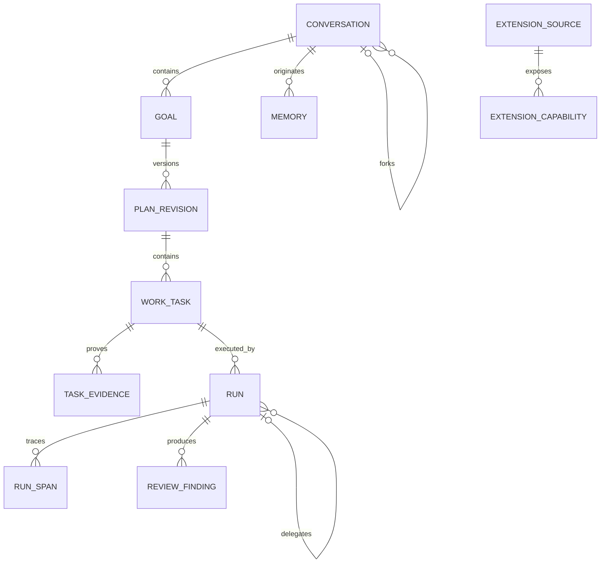
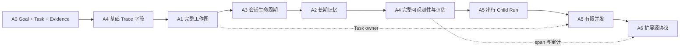

# Fox Agent A0-A6 实施方案

> 状态：已归档；A0-A6 已完成，本文仅保留原始设计与取舍背景<br>
> 适用版本：Fox `0.1.x` 及后续版本<br>
> 维护范围：A0-A6 Agent 能力演进<br>
> 最后更新：2026-08-24
>
> 范围：A0 最小工作闭环、A1 完整工作图、A3 会话生命周期、A2 长期记忆、A4 可观测性与评估、A5 原生子 Agent、A6 扩展源协议<br>
> 明确不包含：A7 模型路由、A8 自动化/后台任务、A9 远程 Fox Runtime，以及本轮已冻结的知识库和文档预览增强<br>
> A0 历史规格：`docs/归档/研究与方案/A0最小工作闭环规格.md`<br>
> 当前能力与进度：`docs/01-项目概览/能力矩阵.md`、`docs/07-路线图/Agent能力路线图.md`

## 1. 结论摘要

Fox 不应把六项能力做成彼此独立的页面或工具，而应建立一条共享的产品主线：

```text
会话与 Agent
  -> Goal / Plan / Task 工作图
  -> Run / Tool / Approval 执行证据
  -> Review / Acceptance 验收
  -> 可选择沉淀的 Memory
  -> 可分支、恢复和归档的 Conversation
  -> 可追踪、可回归的 Trace / Evaluation
  -> 受预算和权限约束的 Child Run
  -> 统一注册的 Extension Source
```

综合建议如下：

1. 保持 SQLite 为 Fox 产品状态的唯一事实源；Pi、知识库智能体和未来 Runtime 只负责执行，不拥有计划、记忆、分支、评估等产品状态。
2. 不展示或依赖模型隐藏思考。用户可见的是计划、步骤摘要、工具调用、文件变更、来源、审查与验收证据。
3. 继续使用现有 `runs`、`run_events`、`tool_calls`、`approvals` 作为执行底座，以增量表和版本化事件扩展，不重写已经稳定的流式链路。
4. A0-A6 已按 `A1 -> A3 -> A2 -> A4 -> A5 -> A6` 完成；下一阶段进入 E1-E4 专家能力。
5. 会话 lineage 先于 Memory 来源治理稳定，Child Run 与扩展策略均复用 Host 权限和 Trace 边界。
6. A5 没有复制复杂 Agent Team，而是交付深度 1、有限并发和硬预算的 Host-owned Child Run。
7. A6 交付持久 stdio、Streamable HTTP JSON/SSE、OpenAPI 3.x 受限投影、声明式 Lifecycle Hooks 和统一健康；OAuth、旧版 GET+SSE、任意脚本 Hook 和更细速率配额未进入首版。

### 1.1 2026-07-29 调整记录

- 增加 A0，避免 A1 首个闭环同时落地六层领域模型。
- 基础 Trace 字段提前到 A0，完整 Span 和 Eval 仍属于 A4。
- A3 提前到 A2 之前，让 Memory 来源引用稳定的会话 lineage。
- A5 拆为串行 Child Run 和有限并发两步。
- Evidence 增加有效性状态、校验时间和失效原因。
- 每阶段增加状态机、失败矩阵、迁移 Fixture、性能基线和真实任务验收。
- A0 Milestone 与 #1-#9 已同步到 GitHub；工程实现已合入基线，发布签收仍以仓库清单为准。

### 1.2 2026-07-31 A0 落地状态

- 迁移 14-16 已落地工作图、Work Event、乐观版本和待确认 Run 恢复。
- 前端已订阅独立 Work Event，支持 Goal/Task/Evidence 实时更新与 Evidence 定位。
- 含糊或高风险任务不会自动批准；确认前 Runtime 不启动，刷新或重启后仍可继续或取消同一 Run。
- Work Trace 使用脱敏 DTO，默认不导出工作内容、Evidence refId/metadata/失效原因或事件 data。
- 自动化工程门禁完成后仍需按 Alpha 发布验收清单完成人工安装、录屏和回滚签收。

### 1.3 2026-08-06 Harness 决策

- Fox 使用 Pi `createAgentSession` 承载模型与工具循环，但 Goal、Task、Evidence、审批和恢复仍由 Host + SQLite 持有。
- 不安装会维护独立 plan/todo 文件或 Session 状态的通用 Pi 扩展。所需规划能力通过 Fox Host Tool 接入现有 Work Graph，避免出现第二套事实源。
- Guardian 只作为高风险或规则无法确定时的独立 Reviewer Session，输出结构化 `allow|ask|deny` 建议；Host 的确定性权限规则、路径边界和用户决定始终拥有最终权威，Reviewer 不得执行工具或自行批准。
- 子 Agent 不进入当前 Harness 稳定性改造，保持 A5 后置顺序。先建立单 Agent 的回归评测、缓存观测和错误基线，再实施串行 Child Run。
- `usage.updated` 记录 input/output/cacheRead/cacheWrite/total token。缓存命中率按 `cacheRead / (input + cacheRead)` 计算；Prompt 稳定前缀与工具目录共享 provider 缓存口径。

### 1.4 2026-08-06 跨模型适配基线

- 采用“统一 Harness -> Provider Adapter -> Model Capability Profile -> 少量家族 Quirk”的结构，不为每个模型复制系统提示词。
- Profile 自动识别 MiniMax、DeepSeek、Claude、OpenAI、Qwen、GLM、Kimi、Gemini、Grok、OpenRouter、本地和通用兼容端点；私有模型可通过 `modelProfile` 显式覆盖已知能力。
- Profile 统一驱动 Pi transport provider、reasoning transport、thinking level、Planner、图片/工具/并行/缓存能力、上下文压缩和重试预算，并进入 `ready` 与 `run.request_snapshot` 诊断快照。
- 当前离线适配评测已经演进为 5 个套件、`35/35`；本文原始设计阶段的测试描述仅供追溯，当前口径见 `docs/05-开发指南/Agent能力测试基准.md`。
- SWE-bench Verified/Multilingual、Aider Polyglot 和 Terminal-Bench 用于后续真实编码执行；BFCL 用于真实函数选择和参数准确率；AgentDojo 用于端到端效用/安全联合评分；RAGAS 与 Fox 脱敏真实问答集用于知识库。所有 live eval 必须记录模型、Profile、Prompt hash、工具目录 hash 和构建版本。

### 1.5 2026-08-23 Pi 升级与下一阶段工具扩展

- Pi 三个核心包已从 `0.79.9` 同步升级到 `0.84.2`，Runtime 改用 `ModelRuntime`，并由 `pi-adapter.mjs` 收口所有直接依赖。
- 工具扩展作为 Pi 升级后的下一项横向里程碑，不改变 A0-A6 的数据与产品状态所有权；首批八项工具已完成 Host/Runtime/专家/Skill/插件中心贯通。
- 每个候选工具先检索 Pi 官方仓库和 GitHub 上面向 `@earendil-works/pi-*` 的开源实现；许可证、维护状态、版本兼容、Schema、取消、超时和权限边界合格时，优先通过 Fox Tool Adapter 复用，不重复开发执行逻辑。
- 只注册工具的同步 Pi Extension 可直接进入适配评审；依赖 TUI、任意生命周期 Hook、全局文件权限或自行读取凭据的扩展不得直接加载，只能提取工具定义或改为 Host Handler。
- 工具能力已交付 `web_search`、`web_read`、`http_request`、`system_info`、`sqlite_read`、`git_read`、`structured_data`、`test_run`、`code_check`、`format_code`、`tabular_data`。网页搜索默认使用无 Key 的 DuckDuckGo 兜底；网页和 HTTP 采用逐跳 SSRF 防护；系统采集复用 `sysinfo`；SQLite 查询使用只读连接、Statement 与进度中断；Git 与进程均使用直接参数而非 Shell；表格首版覆盖 CSV/TSV/JSON，XLSX 延后。
- 社区实现用于抽取 Provider 归一化、SSRF、系统采集、SQLite 只读、检测矩阵和工具 Schema 设计经验，但不直接加载第三方 JavaScript 扩展：Fox 的审批、项目授权、SQLite 审计和跨 Agent 兼容要求需要 Host 原生适配器。浏览器自动化与通用外部数据库连接继续后置；认证 HTTP API 统一走 Keyring-backed OpenAPI Connector。
- 每个复用候选都要保留上游仓库、许可证、固定版本或 Commit、Hash、Fox 工具名、执行位置、审批策略和替代/下线方案；未通过评审时继续使用现有 Fox 工具，不因引入扩展降低安全边界。

## 2. Fox 规划前基线（历史）

### 2.1 已有能力

- SQLite 已持久化 Agent、会话、消息、Run、Runtime Session、Run Event、工具调用、审批、附件、产物、知识库绑定、Skills、stdio MCP 和模型配置。
- Runtime Host 已有 FIFO Run 队列、取消、Sidecar 恢复、会话恢复、事件去重和终态回写。
- 前端已有乐观消息、Runtime 事件监听、轮询补偿、历史分页、工具步骤、审批和用户补充问题。
- Runtime 协议已有 capability manifest，支持流式文本、reasoning 摘要、取消、Session 恢复、工具审批和上下文压缩。
- Agent 详情页已有工作记录、对话任务、Skills、工具入口；记忆页目前是占位状态。

### 2.2 当时的关键缺口

| 领域 | 当前缺口 | 直接影响 |
| --- | --- | --- |
| 工作闭环 | 没有 Goal、Plan、Task、Review、Acceptance 的正式状态 | 模型停止生成不等于任务完成，复杂任务无法稳定续跑 |
| 长期记忆 | 没有可治理的记忆实体和召回记录 | 重复协作依赖长对话，用户无法确认或删除模型记住的内容 |
| 会话生命周期 | 只有基础创建、重命名、删除、搜索 | 无归档、收藏、回收站、fork、分支来源和恢复策略 |
| 可观测性 | Run Event 可诊断，但缺少统一 trace、耗时分段和评估集 | 能看到失败结果，却难以定位排队、模型、工具或 UI 哪一段异常 |
| 子 Agent | Runtime Host 当前对本地 Run 全局串行 | 无父子任务、并发预算、上下文隔离、取消传播和结果聚合 |
| 扩展源 | MCP 仅 stdio，且每次发现/调用重新启动进程 | 无持久连接、HTTP MCP、OAuth、OpenAPI、Hook 和统一健康管理 |

### 2.3 现有代码边界

- 数据库迁移：`apps/desktop/src-tauri/src/database/migrations.rs`
- 数据访问：`apps/desktop/src-tauri/src/database/repositories.rs`
- Runtime Host：`apps/desktop/src-tauri/src/runtime_host/mod.rs`
- Runtime 协议：`apps/desktop/src-tauri/src/runtime_host/protocol.rs`
- Pi Runtime：`services/agent-runtime/src/pi-runtime.mjs`
- Session 恢复：`services/agent-runtime/src/runtime-session.mjs`
- 事件映射：`services/agent-runtime/src/pi-event-mapper.mjs`
- 前端事件归并：`apps/desktop/src/features/conversations/model/runtime-event-reducer.ts`
- 会话 Hook：`apps/desktop/src/features/conversations/hooks/use-desktop-conversation.ts`
- Agent 页面：`apps/desktop/src/features/agents/agent-pages.tsx`

## 3. 产品定位与设计原则

### 3.1 不直接照搬任何一个竞品

| 产品 | 核心定位 | Fox 应学习 | Fox 不应照搬 |
| --- | --- | --- | --- |
| Craft | 桌面工作空间中的 Agent 协作 | 用户可见的工作状态、来源/工具整合、低干扰交互 | 与其产品数据模型强绑定的内部实现 |
| Hermes | 高自主、可扩展的个人 Agent | 持久记忆、Skills、工具扩展、自主任务分解 | 默认高自治和偏 CLI 的操作方式 |
| Kun | 本地优先的 Agent Runtime 与桌面产品 | Plan/Todo、结构化记忆、Hook、MCP 搜索、工作区信任 | 与其文件存储和当前 Thread 契约直接耦合 |
| Claude | 成熟编码 Agent 与 SDK | Plan/Task、Session、子 Agent、Hooks、MCP、OTel | 编码场景专属假设、专有 Session 格式和过高并发默认值 |
| Fox | 本地桌面执行 + 可选知识服务 | 透明、可恢复、可管理、Runtime 中立 | 重新自研模型循环或暴露隐藏思考 |

### 3.2 共享架构原则

1. **产品状态归 Fox**：Goal、Plan、Task、Memory、Conversation lineage、Trace、Evaluation 和 Delegation 全部落 SQLite。
2. **Runtime 只执行**：每次 Run 接收版本化快照，通过 Host Tool 提交结构化变更请求，不能直接改数据库。
3. **显式过程替代隐藏思考**：过程栏只显示可审计事实，provider reasoning 仅作为可选、受限的运行信息，不能成为计划或验收依据。
4. **证据优先**：Task 完成必须能够引用工具结果、测试、diff、文件、来源或用户确认；没有证据时标记为“模型声明完成”。
5. **权限只能收窄**：子 Agent、扩展源和记忆召回都不得扩大父会话的项目、工具、知识库或凭据权限。
6. **先本地可靠，再开放扩展**：默认单机 SQLite 与本地 Runtime 可完整工作；网络扩展故障不能破坏本地会话。
7. **内容默认不进入遥测**：指标默认记录结构化元数据；Prompt、文件正文、工具输出和记忆内容必须显式开启并脱敏。

## 4. 总体数据关系



表名在实施时可调整，但关系和所有权不应改变。

## 5. A0 最小工作闭环

A0 是正式实施的第一个 Milestone，只交付 `Goal -> Task -> Evidence`：

- 不创建 PlanRevision、ReviewFinding 或 Acceptance。
- 复杂任务创建 Goal，并拆分为可恢复的 Task。
- 完成 Task 必须关联 Evidence，或继续保持非完成状态。
- Evidence 支持 `tool_call`、`trace_span`、`test_result`、`file_diff`、`artifact`、`user_confirmation`、`external_reference`。
- Evidence 记录 `validity_status`、`checked_at` 和 `invalid_reason`，引用失效时保留历史。
- Run、Run Event、Tool Call 和 Evidence 从 A0 开始携带可空 `trace_id`、`span_id`。
- App 重启后从 SQLite 恢复工作状态；简单问答不创建 Goal。

A0 的历史状态机、失败矩阵、数据表、性能预算和迁移测试要求见[A0 最小工作闭环规格](A0最小工作闭环规格.md)。当时的可执行项保留在 GitHub Milestone 与 Issue `#1` 至 `#9` 中。

A0 验收使用一个跨三个文件的 Bug 修复任务：至少产生“定位、修改、验证”三个 Task，每个完成 Task 至少有一条 Evidence；同时用解释函数等简单问答确认不会误建 Goal。

## 6. A1 Agent 工作闭环

### 6.1 目标

把当前“用户消息 -> Run -> 回复”的执行链扩展为：

```text
识别任务复杂度
  -> 创建或确认 Goal
  -> 提议 Plan Revision
  -> 用户批准或自动激活
  -> 逐项执行 Task
  -> 绑定 Evidence
  -> 独立 Review
  -> Acceptance
  -> 完成、阻塞或继续修订
```

简单问答不强制创建计划。满足任一条件时进入结构化工作模式：多文件修改、多工具链、预计超过一个 Run、用户明确要求计划、存在验收条件或高风险操作。

### 6.2 竞品对比

| 产品 | 已验证做法 | 优点 | 局限 | Fox 取舍 |
| --- | --- | --- | --- | --- |
| Craft | `Plan` 有 creating/refining/ready/executing/completed/cancelled 状态、步骤状态和 refinement history；`submit_plan` 会暂停执行等待用户；Session 保存 pending plan execution。 | 计划审批和继续执行的桌面交互成熟，状态直观。 | Plan、会话状态和完成结果仍较松散；缺少 Goal、Evidence 和独立 Acceptance。 | 复用 Plan 审批抽屉和“批准后继续”的交互，但把计划放入 Work Graph，不以 plan 文件作为事实源。 |
| Hermes | Session 内有 `todo`；`.plans` 保存计划；Kanban worker 支持依赖、heartbeat、block/unblock、structured handoff，并可 fan-out 子任务。 | 自主任务推进和多执行器协作强，适合长任务。 | Todo、计划、Kanban 和最终回答属于多个子系统；默认自治程度高，用户验收较弱。 | 学习任务依赖、阻塞和结构化 handoff；首版不引入无人值守 Kanban dispatcher。 |
| Kun | Thread 原生持有 Goal 与 Todo；Goal 支持 active/paused/blocked、预算和完成状态；Todo 限制一个 in-progress；计划是带版本/hash 的 GUI 工件；独立只读 Reviewer 输出 P0-P3 findings。 | Goal、计划、进度和独立审查的领域边界清晰，Reviewer 权限隔离可靠。 | Goal、Plan、Todo、Review 仍是多组原语，缺少统一 Acceptance 与逐条验收证据。 | 直接借鉴 Goal/Plan/Todo 工具契约、单 active step、只读 Reviewer 和 P0-P3 finding，但统一落入 Fox Work Graph。 |
| Claude | `/goal`、Plan mode、TaskCreate/Update/Get/List、独立 Code Review 共同覆盖目标、计划、依赖任务和审查；SDK 可流式监听任务变化。 | 计划阶段只读、任务有依赖、Reviewer 独立，成熟度最高。 | 四组原语仍未形成单一状态机；完成可能依赖 Agent 自报，Goal evaluator 主要看 transcript。 | 将这些原语统一为 Goal -> PlanRevision -> Task DAG -> Evidence -> Review -> Acceptance。 |

### 6.3 Fox 综合建议

Fox 应采用“统一工作图”，而不是分别实现目标卡片、Todo 列表和 Review 页面：

- `Goal`：用户意图和完成条件，一个会话可有多个历史 Goal，但同时只允许一个 active Goal。
- `PlanRevision`：每次改计划创建新版本，不原地覆盖历史。
- `WorkTask`：支持顺序、依赖、状态、负责人、阻塞原因和重试来源。
- `TaskEvidence`：引用 Run Event、Tool Call、Artifact、Attachment、文件 diff、测试结果、来源或用户确认。
- `ReviewFinding`：独立于执行结果，包含严重度、证据、建议和处理状态。
- `Acceptance`：逐条判定验收条件，区分确定性检查、模型判断和用户确认。

Pi 仍负责模型与工具循环；Fox 通过 Host Tool 和系统提示让 Runtime 读取/提交工作状态。这样不会重新实现 Agent Loop。

这里明确以 `Goal` 为聚合根，不再并列增加另一套 `agent_tasks` 主任务表。A5 的子任务继续使用 `WorkTask.parent_task_id` 和 delegation 关系表达，避免 Goal、Task 与“Agent Task”形成重叠事实源。

### 6.4 数据模型

建议新增：

- `goals(id, conversation_id, title, objective, acceptance_json, status, revision, created_by, created_at, updated_at, completed_at)`
- `plan_revisions(id, goal_id, version, summary, status, author_run_id, approved_at, superseded_by, created_at)`
- `work_tasks(id, plan_id, parent_task_id, ordinal, title, detail, status, owner_run_id, dependency_json, attempt, started_at, finished_at)`
- `task_evidence(id, task_id, evidence_type, ref_id, summary, metadata_json, created_at)`
- `review_findings(id, goal_id, task_id, run_id, severity, title, detail, evidence_json, status, created_at, resolved_at)`
- `acceptance_results(id, goal_id, criterion_key, method, status, evidence_json, checked_by_run_id, created_at)`

所有状态修改使用乐观版本号，避免 UI、Runtime 和恢复任务相互覆盖。

### 6.5 Runtime 与事件协议

新增 Host Tools：

- `work_snapshot_get`
- `goal_propose`
- `plan_replace`
- `task_update`
- `task_evidence_add`
- `review_submit`
- `acceptance_submit`

新增标准事件：

- `goal.proposed|activated|updated|completed|blocked`
- `plan.proposed|approved|revised|superseded`
- `task.started|progress|completed|blocked|skipped`
- `review.started|finding|completed`
- `acceptance.checked|completed`

事件必须包含 `schemaVersion`、`goalId`、`taskId`、`runId` 和可选 `evidenceRefs`。Capability Manifest 增加版本化 `workGraph` 能力；JSONL envelope 本身可保持 v1，减少对稳定流式链路的影响。

### 6.6 UI

- 复用现有工作过程行：左侧显示已完成/总步骤，中央显示当前 Task 摘要，右侧展开工作图。
- 展开内容只显示计划、工具、文件、来源、审批和验收，不显示隐藏思考原文。
- 右侧 Todo 工具栏接入当前 Goal 的 Task 列表；没有结构化任务时保持空状态。
- 高风险或大范围任务在执行前显示 Plan 审批；低风险任务可按 Agent 设置自动激活。
- 完成后保留整个过程，不随最终回复消失。
- Agent 详情的“对话任务”可按 Goal 状态筛选，并进入具体工作记录。

### 6.7 恢复与失败

- App 重启后从 SQLite 恢复 active Goal、Plan 和 Task，不从模型文本猜测状态。
- Run 中断时仅把所属 Task 标记为 `interrupted`，不自动将 Goal 标记失败。
- 重试创建新 Run 和新 attempt，保留旧 Evidence 与错误。
- 模型停止但验收未通过时，Goal 保持 `needs_review` 或 `active`。
- 连续无法推进时标记 `blocked`，并明确所需用户输入或外部条件。

### 6.8 验收标准

1. 多步骤任务重启 App 后可从未完成 Task 继续。
2. 修改计划产生新版本，旧版本和执行证据仍可查看。
3. Task 完成状态可追溯到至少一个 Evidence，或明确标记“仅模型声明”。
4. 验收失败会重新打开 Task，不会显示“已完成”。
5. 简单问答不额外制造计划 UI。
6. Fox、Pi 和知识库智能体都映射为同一工作图事件。

## 7. A2 长期记忆

### 7.1 目标

建立用户可见、可编辑、可删除、可追溯且按作用域隔离的长期记忆。记忆不是完整聊天记录，也不是凭据存储。

### 7.2 竞品对比

| 产品 | 已验证做法 | 优点 | 局限 | Fox 取舍 |
| --- | --- | --- | --- | --- |
| Craft | 主要依靠 workspace instructions、session context、用户偏好和 Sources；本地审查未发现一套独立、用户可治理的长期 Memory 实体。 | 上下文与工作空间结合紧，用户显式配置较透明。 | 缺少跨会话事实/偏好的提议、来源、过期、召回和删除审计。 | 不把会话摘要或 Source 当作记忆，建立独立 Memory 域模型。 |
| Hermes | `MEMORY.md` 与 `USER.md` 有严格字符预算，Session 启动时冻结注入；支持 add/replace/remove、写入审批、待审队列、安全扫描、后台自我改进；SQLite FTS5 提供按需 Session Search，并支持外部 Memory Provider 插件。 | 记忆闭环最完整，容量边界、通知、审批和检索分层非常清楚。 | 默认允许自动写入；两份 Markdown 非结构化，缺少逐条版本、TTL、冲突与细粒度作用域；启动后快照不会实时更新。 | 采用“核心记忆 + 按需会话检索 + proposal gate”，但每条记忆结构化、版本化并默认按项目/Agent 隔离。 |
| Kun | `FileMemoryStore` 提供 user/workspace/project scope、tags、confidence、sourceThreadId/sourceTurnId、retrieve/list/diagnostics、原子写和 tombstone 删除；`memory_create` 明确要求用户批准。 | 与 Fox 需求最接近，来源、作用域、信心和删除语义已经成型。 | 文件存储和检索能力较轻；缺少版本表、召回原因、TTL 和敏感内容治理。 | 以 Kun 的记录字段和审批语义为直接参考，改用 SQLite + FTS + revision/retrieval audit。 |
| Claude | `CLAUDE.md` 与 auto memory 分层；按 user/project/local/Agent scope 隔离；`MEMORY.md` 小索引常驻、主题文件按需读取；`/memory` 可管理。 | 纯文本透明、上下文预算明确，Agent 记忆可独立。 | 元数据、来源、置信度、过期和冲突处理较弱；主要是本机文件。 | 保留“小索引 + 按需正文”的预算思路，产品状态仍由 SQLite 管理并可导出 Markdown。 |

### 7.3 Fox 综合建议

采用“结构化元数据 + 人可读正文 + FTS 按需召回”：

- 类型：`preference`、`fact`、`decision`、`procedure`、`constraint`、`summary`。
- 作用域：`user`、`agent`、`project`；会话摘要属于会话数据，不自动升级为长期记忆。
- 状态：`proposed`、`active`、`disabled`、`superseded`、`expired`、`deleted`。
- 默认策略：模型只能提出记忆建议；用户偏好和项目决策可按设置自动接受，跨项目、敏感或低置信度内容必须确认。
- 召回：先按 Agent/项目/类型过滤，再用 FTS、置信度、最近验证时间和使用频率排序；首版不引入向量数据库。
- 预算：每个 Run 的记忆索引和正文都有独立 token/字符上限，详细内容按需读取。

### 7.4 数据模型

- `memories(id, memory_type, scope_type, scope_id, owner_agent_id, title, content, status, sensitivity, confidence, source_type, source_ref_id, created_at, updated_at, last_verified_at, expires_at, supersedes_id)`
- `memory_revisions(id, memory_id, version, content, metadata_json, changed_by, created_at)`
- `memory_retrievals(id, memory_id, run_id, score, reason, injected_chars, created_at)`
- `memory_fts(memory_id, title, content)`

首版使用 `supersedes_id` 和状态标记表达偏好变化与被替代关系；当真实数据证明需要多对多冲突治理时，再增加 `memory_conflicts`，避免 A2 首版提前引入尚未验证的复杂模型。

凭据、Token、密码、私钥和疑似密钥内容禁止写入 Memory；设置层提供敏感模式和全部清除。

### 7.5 Runtime 与 UI

Host Tools：`memory_search`、`memory_read`、`memory_propose`、`memory_feedback`。Runtime 不能直接保存 active Memory。

Agent 详情的“记忆”页面从占位页升级为：

- 作用域、类型、状态筛选。
- 查看来源对话/工具/文件和“为何被召回”。
- 编辑、禁用、删除、合并、重新验证。
- Proposed 队列和批量接受/拒绝。
- 项目页面显示当前项目记忆；用户级设置提供总览与清理。

### 7.6 验收标准

1. 不同项目和 Agent 的记忆默认互不可见。
2. 用户能定位每条记忆的来源，并可编辑、禁用、删除。
3. 删除或禁用后，后续 Run 不再召回。
4. 召回失败不阻断主对话。
5. 每次注入都记录原因和预算，诊断页可查看。
6. 密钥检测测试覆盖常见 API Key、Bearer Token、私钥和密码格式。

## 8. A3 会话生命周期

### 8.1 目标

让会话具备可管理的状态、可恢复的执行和清晰的分支来源，而不是只有创建和硬删除。

### 8.2 竞品对比

| 产品 | 已验证做法 | 优点 | 局限 | Fox 取舍 |
| --- | --- | --- | --- | --- |
| Craft | Session header 保存 archive、flag、custom status、labels、unread、pending plan、branch anchors；分支有消息 cutoff 和 provider-native turn anchor，并有 branch rollback/cleanup 测试。 | 桌面会话生命周期最接近 Fox，列表无需加载全文，分支语义和测试完整。 | JSONL header 是核心事实源；provider branch metadata 较多，迁移到其他 Runtime 时复杂。 | 复用其元数据、列表优化、分叉锚点和回滚测试，用 SQLite 保存标准 lineage，不暴露 provider 私有字段。 |
| Hermes | SQLite/WAL 保存 Session 与消息，`parent_session_id` 形成 lineage；支持 reopen、title、FTS5、export、prune、retry/undo/new/reset；多进程写入有 jitter retry 和 WAL checkpoint。 | 并发存储和跨平台 Session 搜索扎实，迁移链清晰。 | lineage 主要服务压缩分段，不等同于用户主动 fork；归档、收藏、回收站产品语义较弱。 | 学习 SQLite contention、FTS 和 lineage 查询；主动 fork、archive、trash 由 Fox 产品层补齐。 |
| Kun | Thread 状态覆盖 idle/running/archived/deleted，关系类型包含 primary/fork/side；fork 按 turn 快照复制消息与 Todo；重启后可修复 orphan Run 并恢复 active Goal。 | 应用层 fork、孤儿执行修复和 Goal 恢复语义清晰，跨 Runtime 更稳定。 | 无收藏语义；fork 主要是产品层快照，不是 provider-native context fork。 | 将 Kun 的快照分支和恢复机制作为跨 Runtime 基线，收藏与 provider-native fork 由 Fox 补齐。 |
| Claude | JSONL transcript 支持 name、continue、resume、branch/export；SDK 支持 fork、rename、tag、delete 和外部 SessionStore；分支拥有新 Session ID。 | 生命周期和 lineage 完整，适合跨主机与 SDK 集成。 | 同一 Session 并发恢复可能交错；外部 Store 是 best-effort 镜像；JSONL 私有格式不稳定。 | 新分支必须新 Runtime Session；SQLite 为事实源，并用 revision/active-run guard 防并发写入。 |

### 8.3 Fox 综合建议

新增以下生命周期：

- `active`：正常显示。
- `waiting`：等待用户、审批或外部服务。
- `completed`：当前 Goal 已验收，仍可继续消息。
- `archived`：从默认列表隐藏，但数据保留。
- `trashed`：进入回收站，保留期后清理。

同时支持收藏、标签、重命名、归档、恢复、软删除和 fork。

Fork 规则：

1. 只能从已持久化的消息边界创建。
2. 新会话记录 `parentConversationId`、`forkMessageId`、`forkRunId` 和 branch name。
3. 复制 Fox 标准消息投影与必要附件引用，不复制 Pi/供应商私有 metadata。
4. 新分支创建新的 Runtime Session，并以标准历史重建上下文。
5. 原会话继续保持可用，两条分支互不写入。

本地首版采用物化复制标准消息，优先可靠性和查询简单性；附件、产物文件使用引用计数，避免重复占用磁盘。

恢复规则补充：App 启动时扫描非终态 Run，将缺少活跃 Runtime/心跳的记录标记为 `interrupted`；随后按 Conversation revision、未完成 WorkTask 和 active Goal 重建可继续状态。恢复不能只依赖 Runtime 的 session resume 成功。

### 8.4 数据模型

- `conversations` 增加 `lifecycle_state`、`favorite`、`parent_conversation_id`、`fork_message_id`、`fork_run_id`、`branch_name`、`archived_at`、`deleted_at`、`revision`。
- `conversation_tags(conversation_id, tag)`。
- `stored_file_refs(storage_path, ref_count, byte_size, updated_at)`，供分支共享附件与产物文件。

### 8.5 UI

- 会话菜单增加收藏、归档、从此处分支、移动到回收站。
- 搜索支持 active/archive/trash、Agent、项目、标签和日期。
- 对话顶部可打开分支树；显示父分支、分叉消息和子分支。
- “继续”用于同一会话的终态 Run；“分支”始终创建新会话。
- 归档与删除语义分开，回收站显示剩余保留天数。

### 8.6 验收标准

1. Fork 后两条会话继续运行且互不污染 Runtime Session。
2. 分支来源可从 UI 双向跳转。
3. 归档不删除历史、附件、产物和工作图。
4. 回收站恢复后 FTS、项目关系和记忆来源仍有效。
5. 删除父会话不会破坏保留中的子分支共享文件。
6. 同一会话不得同时启动两个会写入同一 Runtime Session 的 Run。

## 9. A4 可观测性与评估

### 9.1 目标

回答四个问题：发生了什么、时间花在哪里、为什么失败、修改后是否退化。

### 9.2 竞品对比

| 产品 | 已验证做法 | 优点 | 局限 | Fox 取舍 |
| --- | --- | --- | --- | --- |
| Craft | Session 持久化 token/context/cost、消息与工具状态；有大量 durability、branch、lazy-load、source retry 和 MCP pool 测试，并接入错误监控/遥测依赖。 | 对桌面会话稳定性和边界条件覆盖广。 | 未发现面向用户的完整 trace waterfall、任务验收指标或回归数据集产品。 | 将 Craft 的故障场景测试转化为 Fox 回归集，观测模型统一到 Run Span。 |
| Hermes | SQLite 聚合 token、tool call、API call；trajectory JSONL 保存成功/失败会话、工具成功率和 batch metadata，可用于调试、训练和 RL；`/usage`、`/insights` 提供使用分析。 | 轨迹数据和批量研究能力强，失败样本保留清晰。 | 轨迹可含原始 reasoning 和完整内容，隐私风险高；生产 trace、TTFT/审批等待和在线质量评估不如 Claude 系统化。 | 借鉴 trajectory/eval 数据集思想，但默认只存结构化事件；内容进入评估集必须显式脱敏。 |
| Kun | 有 usage/cache/tool telemetry、append-only session events、Memory/MCP diagnostics 和大量工具策略测试。 | 轻量、贴近本地 Runtime，诊断字段容易落地。 | 缺少统一 trace/span 关联、瀑布图和端到端评估集。 | 复用其工具 telemetry 形式，向上统一为 trace/span 和稳定错误 taxonomy。 |
| Claude | Code/SDK 可导出 OTel metric/event/trace，覆盖 turn、LLM、tool、permission wait、hook、子 Agent、TTFT、token、retry；内容默认不采集。 | 生产可观测性最完整，父子链和隐私默认设计成熟。 | Trace 仍有 beta 字段；没有完整任务验收回归框架，采用率不等于质量。 | 采用 OTel 语义和内容默认关闭；另建 Evaluation Suite，以 Goal Evidence 计算成功。 |

### 9.3 Fox 综合建议

采用两层设计：

1. **Observability**：生产 Run 的 trace、span、metric、错误与脱敏诊断。
2. **Evaluation**：固定用例、环境快照、确定性断言、模型 rubric、人工标签与版本对比。

不把 Token 费用统计纳入产品范围；保留 input/output/cacheRead/cacheWrite/total token，用于上下文、Prompt/工具目录缓存和性能诊断。

### 9.4 Trace 与指标

为 Session、Goal、Task、Run、模型请求、工具、审批和子 Agent 分配关联 ID。至少记录：

- 排队时长、Runtime 启动/恢复时长。
- provider 首字节、首 Token、最后 Token、总生成时长。
- 工具排队、审批等待、执行和结果回传时长。
- 重试次数、错误类型、取消来源、恢复次数。
- 输入/输出/缓存读写 Token、缓存命中率、稳定 Prompt/动态上下文/工具目录哈希、上下文裁剪与压缩次数。
- 事件接收、UI 合并和轮询补偿数量，用于防止流式回归。
- 子 Agent 深度、并发峰值、预算消耗和结果大小。

### 9.5 数据模型

- `run_spans(id, trace_id, parent_span_id, run_id, task_id, span_type, name, status, started_at, ended_at, attributes_json, error_code)`
- `run_metrics(run_id, queue_ms, runtime_start_ms, first_token_ms, generation_ms, approval_wait_ms, tool_ms, retries, input_tokens, output_tokens, event_count, poll_recoveries, updated_at)`
- `evaluation_suites(id, name, description, version, created_at, updated_at)`
- `evaluation_cases(id, suite_id, name, input_json, environment_json, assertions_json, enabled)`
- `evaluation_runs(id, suite_id, build_version, model_snapshot_json, status, started_at, ended_at)`
- `evaluation_results(id, evaluation_run_id, case_id, status, score, assertion_results_json, judge_json, artifacts_json)`

### 9.6 诊断与评估 UI

- Run 详情显示瀑布图：排队、Runtime、模型、工具、审批、渲染。
- 错误按稳定 taxonomy 聚类，而不是只展示 provider 文本。
- 一键导出脱敏诊断包；默认不含 Prompt、文件正文、记忆正文和工具完整输出。
- 评估页支持运行固定场景、对比两个构建/模型快照、查看失败证据。
- 首批回归集必须覆盖曾发生的消息延迟、终态不刷新、reasoning 混入回答、工具等待用户、长回复截断、附件读取和知识检索。
- 外部评测按能力分层接入：SWE-bench Verified/Multilingual 与 Aider Polyglot 覆盖编码，Terminal-Bench 覆盖终端任务，BFCL 覆盖工具调用，tau-bench 覆盖多轮业务工具，AgentDojo 覆盖 Prompt Injection，RAGAS 配合 Fox 脱敏真实问答集覆盖知识库。OSWorld/WebArena 留到桌面与浏览器工具成为稳定产品能力后再接入。

### 9.7 验收标准

1. 任一 Run 能定位首 Token、工具、审批和 UI 补偿耗时。
2. Trace 可跨父子 Run 和 MCP/知识服务调用关联。
3. 默认导出不泄露凭据与用户内容。
4. 同一评估集可重复运行并比较版本差异。
5. 确定性断言优先于模型 Judge；Judge 结果记录模型和 rubric 版本。
6. 观测逻辑异常不得阻断正常 Run。

## 10. A5 原生子 Agent

### 10.1 目标

支持主 Agent 将明确、有限、可并行的子任务委派给隔离执行上下文，并可靠汇总结果。

### 10.2 竞品对比

| 产品 | 已验证做法 | 优点 | 局限 | Fox 取舍 |
| --- | --- | --- | --- | --- |
| Craft | `spawn_session` 创建独立 Session，可继承/覆盖 model、connection、sources、permission、thinking、cwd、labels，fire-and-forget 并进入 Session 列表。 | 桌面产品中创建平行工作流很自然，Source 与权限继承清楚。 | 更像“启动另一条会话”，没有稳定的父任务结果回传、取消传播和 gather/synthesize。 | 复用配置继承与独立 Session，但 Child Run 默认隐藏在主工作图下，并必须结构化回传。 |
| Hermes | `delegate_task` 可一次启动一个或多个隔离子 Agent；各自拥有 conversation、terminal session、toolset，只把最终 summary 返回；Kanban worker 另有依赖、heartbeat、block、child task 和 structured handoff。 | 上下文隔离、并行和长任务调度强，能显著降低主上下文噪声。 | 自治和系统复杂度高；共享持久容器时仍可能文件冲突；最终摘要可能丢失证据。 | 采用隔离 context + final summary + Artifact/Evidence；首版限制深度和并发，不上完整 Kanban。 |
| Kun | 已有独立 delegation runtime、child agent executor 和 delegation tool provider，显式管理子任务执行与结果回传。 | 与 Fox 自建宿主调度器的方向接近，适合作为生命周期和适配层参考。 | 仍需由 Fox 收紧 DAG 深度、权限继承、并发预算、取消传播和写入冲突策略。 | 参考其 delegation 分层，但复用 Fox WorkTask、Run、Evidence 和 Approval，不平行复制一套任务域。 |
| Claude | 子 Agent 可配置 prompt/model/tools/permission/maxTurns/skills/MCP/hooks/memory/effort/background/worktree，支持恢复、消息、fork 和多层嵌套；Trace 保留父子关系。 | 契约最全面，角色、权限、预算和隔离可独立控制。 | 成本与上下文增长快；并发默认值不适合桌面；Teams 仍实验性。 | 采用结构化 delegation envelope、预算、resume、worktree 和取消传播；默认并发 2、深度 1。 |

### 10.3 Fox 综合建议

当前实现不增加平行角色表。`child_agent_list` 从 Host 注册的本地 Assistant/Expert/Worker 中选择执行者；委派请求包含目标、显式 context、Agent 和时间/Token/输出/工具预算。Task/Evidence 可由父 Agent 在结果汇总后关联，delegation 本身不拥有第二套 Task 状态。

不在首版实现自由群聊式 Agent Team。先实现稳定的 `fan-out -> gather -> synthesize`，最多一层嵌套；验证稳定后再评估更深层级。

产品层只有一种工作任务：`WorkTask`。`child_run_delegations` 只描述父 Run 如何调用 Child Run，不拥有第二套 Todo 或验收结果。

### 10.4 运行模型

Primary Runtime Host 保持一个 active Run 和 FIFO；Child Run 使用独立 RuntimeHost/Sidecar，不占用主队列。当前受控执行池规则为：

- 每个 root 最多同时活动 3 个 Child Run，每父 Run 最多创建 8 个，深度固定 1。
- 每个 Child Run 使用独立 Runtime Session，不写入主会话 transcript。
- 父 Run 取消向所有后代传播；子任务失败汇总给父任务，不直接把主 Goal 判为失败。
- 子 Agent 权限是父权限、角色权限和任务权限的交集。
- 子 Agent 不能自行批准高风险操作；审批上浮到父会话。
- 共享项目写入不自动创建 worktree；Runtime 指令要求父 Agent 只并行独立调查/审查或明确不重叠的 writer。

串行和并发都使用同一 `child_run_delegations`、父子 Run 字段和事件契约。

### 10.5 数据模型

- `child_run_delegations(id, parent_run_id, child_run_id, child_conversation_id, tool_call_id, worker_agent_id, objective, context, status, max_* budgets, result_text, usage/tool/error/timestamps)`。
- `runs` 增加 `root_run_id`、`parent_run_id`、`depth`、`run_kind` 和 `budget_json`。
- `conversations` 增加 `conversation_kind=primary|child`；Child transcript 存在隐藏 Conversation，不进入主列表。

Child Run 的详细输出保存在独立 transcript；返回父 Agent 的结果为结构化摘要、Evidence 和 Artifact 引用。用户可按需展开原始证据。

### 10.6 UI

- 对话 Hook 通过 `fox://child-run-updated` 实时维护 Child 状态。
- 对话摘要显示子专家数量、名称和最近状态；父 Agent 可经 `child_run_cancel` 单独取消。
- 详细父子树、预算进度和 worktree 合并 UI 属于后续产品增强，不影响当前 Host 协议与持久化闭环。

### 10.7 验收标准

1. 两个只读子任务可以并行，结果按请求顺序或显式 key 稳定汇总。
2. 父 Run 取消后所有后代在限定时间内进入终态。
3. 子 Agent 无法访问父会话未授权的路径、工具、知识库或凭据。
4. Child Run 崩溃或超时不会丢失其他子任务和父任务状态。
5. Child 的工具/MCP scope 不大于父 Assistant、父 Expert 与 Child Agent 的交集，高风险操作仍上浮到父会话审批。
6. 子 Agent 结果只向父 Agent 注入最多 32,000 字符的持久化摘要；完整 transcript 保留在隐藏 Conversation。

## 11. A6 扩展源协议

> 落地说明（2026-08-24）：A6 已完成。实际首版复用现有 `mcp_servers` 作为兼容注册表，新增 `transport/endpoint_url/definition` 与健康字段，没有平行创建通用 Source/Capability/Connection 表。支持持久 stdio、Streamable HTTP、OpenAPI 3.x、声明式 Hooks 和独立命中审计。原设计中的 legacy GET+SSE、OAuth、外部 `$ref`、operation 选择/独立限流、参数改写、webhook 和任意脚本均未实现；固定服务基址、禁止重定向、15 秒超时、2 MiB 规范/10 MiB 响应上限和 Host Tool 审计构成当前安全边界。当前事实源见[扩展源与策略生命周期架构](../../02-架构/扩展源与策略生命周期架构.md)。以下内容保留为原始设计与后续增强候选，不能视为当前字段契约。

### 11.1 目标

把 Skills、MCP、OpenAPI 和 Hook 放到统一扩展管理模型中，同时保留它们不同的安全语义。

### 11.2 竞品对比

| 产品 | 已验证做法 | 优点 | 局限 | Fox 取舍 |
| --- | --- | --- | --- | --- |
| Craft | Source 统一抽象 MCP/API/local；MCP 支持 HTTP/SSE/stdio；中央 MCP Pool 跨 Runtime/Session 共享连接与工具 cache；API Source 支持多种鉴权和 OAuth refresh；Hooks 覆盖 Tool/Session/Subagent/Compact/Permission 等生命周期。 | 与 Fox 的多 Runtime 桌面架构最接近，Source、连接复用和生命周期扩展较完整。 | Source、Automation、Skill 边界较多且与 workspace 模型耦合；Hook 主要是 prompt/webhook，不是任意插件代码 API。 | Connection Manager、Source Registry 和生命周期事件优先参考 Craft，但保持 Fox 的权限与审计边界。 |
| Hermes | stdio 与远程 HTTP MCP 同一配置；支持 OAuth 2.1/DCR/PKCE、mTLS、include/exclude、动态 tools/list_changed、资源/Prompt、并行 opt-in、sampling 限额和 stdio 生命周期回收；插件可注册 tools/hooks/CLI。 | 远程 MCP、安全选项和大型生态接入最完整。 | 配置复杂，部分凭据落 `.env`/token 文件；没有一等 OpenAPI importer，目录式插件供应链面较大。 | 学习传输、OAuth、过滤、动态发现和资源回收；Fox 凭据仍进 Keyring，OpenAPI 由 Source 层补齐。 |
| Kun | 使用 MCP SDK 建立持久连接，支持 stdio/HTTP transport、workspace trust、startup timeout、重连、catalog fingerprint/drift、tool annotation 风险策略；大工具集通过 `mcp_search/describe/call` 延迟暴露。Hook 覆盖 Pre/PostTool、Prompt、Turn、PreCompact，支持参数/输出重写和阻断。 | 本地工程实现最可直接参考，尤其是 trust、reconnect、tool search 与 Hook 顺序。 | OpenAPI 不是一等 Source；command hook 使用 shell，不适合作为 Fox 首版安全基线。 | MCP Manager、tool search 和 Hook 顺序主要参考 Kun；不继承任意命令 Hook，只保留受限动作。 |
| Claude | 推荐 Streamable HTTP，兼容 SSE/stdio；支持 scope、trust、headers/OAuth 和 tool search。Hook 可为 command/HTTP/MCP/prompt/agent，并支持 allow/deny/ask/defer、输入输出修改和异步副作用。 | 扩展面和生命周期语义完整，Tool Search 适合大目录。 | SSE 已弃用；交互式 OAuth 和 Hook fail-open/closed 边界复杂；无原生 OpenAPI 导入。 | 使用其 Hook 事件语义和 HTTP MCP方向，但首版 Handler 类型、可修改字段和失败策略更保守。 |

### 11.3 Fox 综合建议

统一抽象为 `ExtensionSource`，但不把所有能力伪装成工具：

- Skill：指令和使用规范，不授予权限。
- MCP：工具、资源和 Prompt 能力。
- OpenAPI：经用户选择并分类后的 HTTP operation 工具。
- Hook：生命周期策略或副作用处理器，不属于定时自动化。

支持的 Source Type：

- `mcp_stdio`
- `mcp_streamable_http`
- `mcp_sse_legacy`
- `openapi`

Hook 不作为能直接执行任意代码的 Source Type。它通过独立 `hook_bindings` 绑定事件，首版动作只允许通知、webhook、安全上下文注入、阻断，以及白名单内的工具参数改写。

新建远程 MCP 默认使用 Streamable HTTP；SSE 只用于兼容导入。MCP 实现应迁移到成熟 SDK，不继续扩展当前手写 JSON-RPC。

### 11.4 连接与能力模型

- `extension_sources(id, source_type, name, scope_type, scope_id, config_json, credential_ref, enabled, trust_state, health_status, protocol_version, capability_hash, created_at, updated_at)`
- `extension_capabilities(id, source_id, capability_type, external_name, fox_name, description, schema_json, risk_level, enabled, metadata_json, discovered_at)`
- `extension_connections(id, source_id, status, last_connected_at, last_error, retry_count, server_info_json)`
- `hook_bindings(id, source_id, event_type, matcher_json, mode, timeout_ms, failure_policy, enabled, ordinal)`
- `extension_audit(id, source_id, run_id, capability_id, action, status, duration_ms, summary, created_at)`

stdio MCP 由 Connection Manager 持久管理，不再每次 `tools/list` 和 `tools/call` 都启动新进程。HTTP MCP 支持连接恢复、取消、健康检查、OAuth/headers 和工具延迟发现。

### 11.5 OpenAPI

- 使用标准解析器读取 OpenAPI 3.x，不用字符串拼接 schema。
- 用户选择 operation 后才生成 ToolDescriptor。
- 工具名、输入 schema、server/environment、auth 和 side-effect 等级可预览。
- GET/HEAD 默认 read；POST/PUT/PATCH/DELETE 默认需要审批，允许用户逐项调整。
- 响应设置大小、内容类型和超时上限；大结果落 Artifact，再向模型返回摘要。
- 凭据只保存 Keyring 引用，不写入 OpenAPI 文件、SQLite config_json 或日志。
- 每个 operation 有独立速率限制和单 Run 调用上限，防止循环调用。
- Source 配置必须使用域名 allowlist；重定向后的最终域名也必须重新校验。
- 普通响应和流式响应均执行累计大小限制，超过上限立即取消并将截断信息写入审计。
- 成功、失败、取消和被策略拒绝的调用全部进入审计，不只记录异常。

### 11.6 Hooks

首版事件：`run.before`、`run.after`、`tool.before`、`tool.after`、`tool.failed`、`approval.requested`、`approval.resolved`、`plan.submitted`、`plan.approved`、`task.completed`、`memory.proposed`、`memory.injected`、`subagent.started`、`subagent.completed`、`session.archived`、`session.forked`。

每个 Hook 明确：同步/异步、超时、重试、幂等 key、fail-open/fail-closed、允许修改的字段和审计记录。只有安全策略类 Hook 可阻断；通知/记录类 Hook 默认异步且 fail-open。

首版禁止 Hook 直接运行任意本机脚本或 shell 命令。允许的动作限定为通知、HTTP webhook、追加安全上下文、阻断调用和修改显式白名单内的工具参数；任何修改都必须再次经过 Fox 权限与审批层，Hook 不能扩大权限。

本阶段不实现 cron、事件订阅后自动创建新任务或无人值守后台 Agent，这些属于 A8。

### 11.7 UI

- 设置中的工具页升级为扩展源列表，按 Skills、MCP、API、Hooks 分类。
- 卡片显示连接方式、作用域、能力数量、健康状态和最近检查时间。
- 详情页支持能力开关、风险级别、测试连接、查看 schema 和调用审计。
- 项目级配置必须经过信任确认；从仓库读取的命令、URL 和 header helper 不自动执行。

### 11.8 验收标准

1. stdio MCP 连接可复用，并在崩溃后重连且不遗留进程。
2. Streamable HTTP MCP 能发现和调用工具；SSE 仅作为兼容路径。
3. OpenAPI 导入能正确处理 `$ref`、多 server、认证和错误响应。
4. 未勾选 operation 不会暴露给模型。
5. Hook 的顺序、超时、失败策略和修改范围均有确定性测试。
6. 扩展输出、日志和诊断包不会包含明文凭据。
7. OpenAPI 域名 allowlist、每操作限流、流式累计大小限制和全调用审计均有确定性测试。

## 12. 依赖与实施顺序



| 阶段 | 实施内容 | 进入条件 | 完成门槛 | 规模 |
| --- | --- | --- | --- | --- |
| A0 | Goal、Task、Evidence、恢复和基础 Trace 字段 | 当前 Run/Event 稳定 | 跨三文件任务与普通问答负向场景通过 | M |
| A1 | PlanRevision、Review、Acceptance 和完整 Work Graph | A0 数据模型与恢复稳定 | 复杂任务可修订计划并按证据验收 | L |
| A3 | archive/favorite/trash/fork/branch | A1 提供稳定 Goal/Task 来源 | Fork/恢复/共享文件不丢数据 | M |
| A2 | Memory 实体、提议、管理、召回、冲突与审计 | A3 lineage 稳定 | 作用域隔离、来源追溯与删除语义通过 | L |
| A4 | Run Span、指标、诊断和回归评估 | A1-A3 的稳定 ID 和状态机完成 | 历史流式问题进入回归集 | L |
| A5-serial | Delegation 与串行 Child Run | A1 Task + A4 Trace 完成 | 父子协议、取消、超时与部分 Evidence 通过 | L |
| A5-parallel | Worker Pool 与有限并发 | 串行 Child Run 数据模型稳定 | 并发、隔离、取消和权限测试通过 | XL |
| A6 | Source Registry、HTTP MCP、OpenAPI、Hooks | A4 审计与 A5 权限继承可复用 | 连接、Schema、凭据、限流和输出边界通过 | XL |

## 13. 迁移与兼容策略

1. 每阶段单独增加 SQLite migration；A0 当前最高为 migration 16，后续不修改或重排已有 migration 1-16。
2. 旧会话默认 `lifecycle_state=active`，不自动创建 Goal 或 Memory。
3. 旧 Runtime Event 原样保留；新事件使用 `schemaVersion`，Reducer 对未知事件忽略但持久化。
4. Capability Manifest 用明确版本升级；Host 和 Sidecar 必须同时支持新版本后才启用对应能力。
5. 旧 stdio MCP 配置自动迁移为 `mcp_stdio` Source，凭据引用保持不变。
6. 所有迁移提供幂等测试、旧数据库升级测试、备份恢复测试和失败回滚说明。
7. 每个阶段在 `apps/desktop/src-tauri/tests/migration/` 增加升级、备份恢复和数据完整性 Fixture；旧版本回退采用恢复升级前备份，不尝试让旧程序读取新 Schema。
8. 阶段 PR 缺少对应迁移测试时不得合并。

## 14. 横向风险

| 风险 | 表现 | 控制措施 |
| --- | --- | --- |
| 状态重复 | 模型文本、Runtime Session、SQLite 都声称拥有计划或记忆 | SQLite 唯一事实源，Runtime 只提交命令 |
| UI 过载 | 简单问答也出现 Goal/Task/Review | 复杂度门控，默认折叠，简单任务不建图 |
| 模型自报完成 | 回复写“完成”但测试失败 | Evidence + 独立 Review + Acceptance |
| 记忆污染 | 错误事实跨项目传播 | scope、proposal、confidence、TTL、来源和用户治理 |
| 分支膨胀 | Fork 复制附件和历史占满磁盘 | 标准消息物化、文件引用计数、回收站清理 |
| 遥测泄露 | Prompt、文件或密钥进入日志 | 内容默认关闭、脱敏、采样、Keyring |
| 子 Agent 失控 | 并发、成本、权限和写冲突 | 有限并发、预算、权限交集、取消传播、worktree |
| 扩展供应链 | 项目配置启动任意命令或发往陌生 URL | 项目信任、allowlist、审批、健康与审计 |

## 15. 全阶段完成定义

A1-A6 全部完成需要满足：

1. 用户能从一个复杂目标看到计划、执行、证据、审查与验收，并在重启后继续。
2. 用户能管理 Agent/项目记忆，并知道每次为什么召回。
3. 会话可以归档、恢复、收藏、软删除和从任意稳定消息分支。
4. 任一失败 Run 可以用 trace 定位，并有可重复的回归用例。
5. 主 Agent 可以安全委派有限并发的子任务，结果和产物可追溯。
6. stdio/HTTP MCP、OpenAPI 和 Hook 经过同一权限、凭据、健康和审计边界。
7. A7-A9、知识库增强和文档预览增强没有被隐式带入范围。

## 16. 明确不采用的方案

- 不把 Goal、Plan、Todo 全部塞进消息 metadata 或单个 JSON blob；查询、恢复、版本和评估会失去稳定边界。
- 不启用会在 Runtime Session、Markdown 或 JSON 中另存 plan/todo 状态的通用 Pi 扩展；Pi 扩展只能通过 Fox Host Tool 投影和更新 SQLite Work Graph。
- 不让 Guardian 或模型 Reviewer 覆盖 Host 的确定性权限规则，也不让 Reviewer 执行被审查的操作。
- 不让 Agent 仅凭自然语言声明把 Goal 标记为最终完成；Agent 提交 Evidence，Acceptance 规则或用户完成最终确认。
- 不默认记忆全部对话，也不无上限注入用户级 Memory。
- 不只依赖 provider-native fork；它是精确分支增强，不是跨 Runtime 的产品基础。
- 不把原始 Runtime JSONL 直接当作评估库；生产 Trace 与 Eval 的结构、保留期和隐私要求不同。
- 不在 A5 首版开放任意深度子 Agent、peer-to-peer 群聊或多个 Agent 共享写工作区。
- 不在 A6 首版允许 Hook 执行任意本机脚本，也不在本阶段建设插件市场。
- 不为实现 A1-A6 顺带加入模型路由、自动化后台任务或远程 Fox Runtime。

## 17. 研究来源

### 17.1 Fox 与本地参考仓库

- Fox：`D:\python\projects\Fox\Fox`
- Craft Agents：`D:\python\projects\craft-agents-oss-main`
- Kun：`D:\python\projects\Kun-master`
- Claude 教学实现：`D:\python\projects\claude-code-from-scratch-main`
- Pi Web Access（网络工具与内容提取参考）：https://github.com/ivanreeve/pi-web-access
- pi-mono-web-search（无 Key DuckDuckGo 搜索与结果解包参考，MIT）：https://github.com/emanuelcasco/pi-mono-extensions/tree/main/extensions/web-search
- pi-lens（检查器与格式化检测矩阵参考）：https://github.com/apmantza/pi-lens

### 17.2 Claude 官方资料

- Goal：https://code.claude.com/docs/en/goal
- Permission modes：https://code.claude.com/docs/en/permission-modes
- Todo tracking：https://code.claude.com/docs/en/agent-sdk/todo-tracking
- Code review：https://code.claude.com/docs/en/code-review
- Memory：https://code.claude.com/docs/en/memory
- Sessions：https://code.claude.com/docs/en/sessions
- SDK sessions：https://code.claude.com/docs/en/agent-sdk/sessions
- Session storage：https://code.claude.com/docs/en/agent-sdk/session-storage
- Observability：https://code.claude.com/docs/en/agent-sdk/observability
- Subagents：https://code.claude.com/docs/en/sub-agents
- SDK subagents：https://code.claude.com/docs/en/agent-sdk/subagents
- MCP：https://code.claude.com/docs/en/mcp
- Hooks：https://code.claude.com/docs/en/hooks

### 17.3 Craft 源码证据

- Plan：`packages/shared/src/agent/plan-types.ts:13-145`
- Plan 提交：`packages/session-tools-core/src/handlers/submit-plan.ts:12-49`
- Session 元数据与分支：`packages/shared/src/sessions/types.ts:1-56,99-200,210-302`
- Session 存储与恢复：`packages/shared/src/sessions/storage.ts:520-770`
- Provider 原生分支：`packages/shared/src/agent/claude-agent.ts:1332-1415,1655-1693`
- 独立 Session 委派：`packages/shared/src/agent/spawn-session-tool.ts:1-100`
- 子活动展示：`packages/ui/src/components/chat/TurnCard.tsx:1205-1310`
- Source 类型：`packages/shared/src/sources/types.ts:1-17,238-303,367-528`
- MCP Pool：`packages/shared/src/mcp/mcp-pool.ts:1-56,101-181,225-307,335-450`
- Hooks/Automation 事件：`packages/shared/src/automations/types.ts:14-51,57-186,203-328`
- PreToolUse 生命周期：`packages/shared/src/agent/core/pre-tool-use.ts:672-797`

### 17.4 Kun 源码证据

- Thread/Goal 模型：`kun/src/contracts/threads.ts:10-123`
- Goal Tool：`kun/src/adapters/tool/goal-tools.ts:5-47,104-149`
- Plan Tool：`kun/src/adapters/tool/create-plan-tool.ts:147-238`
- Todo Tool：`kun/src/adapters/tool/todo-tools.ts:5-115`
- 独立 Reviewer：`kun/src/services/review-service.ts:51-220`
- Memory：`kun/src/memory/memory-store.ts`
- Memory Tool：`kun/src/adapters/tool/memory-tool-provider.ts`
- Thread 生命周期与 Fork：`kun/src/services/thread-service.ts:366-494`
- Turn 快照：`kun/src/services/turn-service.ts:391-425`
- Goal 恢复：`kun/src/loop/goal-resume-coordinator.ts:68-182`
- Append-only Session：`kun/src/loop/append-only-session-log.ts`
- Child Agent Executor：`kun/src/delegation/child-agent-executor.ts`
- Delegation Runtime：`kun/src/delegation/delegation-runtime.ts`
- Delegation Tool Provider：`kun/src/adapters/tool/delegation-tool-provider.ts`
- MCP：`kun/src/adapters/tool/mcp-tool-provider.ts`
- MCP Tool Search：`kun/src/adapters/tool/mcp-tool-search.ts`
- Hooks：`kun/src/hooks/hook-engine.ts`、`kun/src/hooks/hook-config.ts`

### 17.5 Hermes 官方资料

- 项目与功能总览：https://github.com/NousResearch/hermes-agent
- Memory：https://hermes-agent.nousresearch.com/docs/user-guide/features/memory
- MCP：https://hermes-agent.nousresearch.com/docs/user-guide/features/mcp
- Tools 与 Delegation：https://hermes-agent.nousresearch.com/docs/user-guide/features/tools
- Architecture：https://hermes-agent.nousresearch.com/docs/developer-guide/architecture
- Session Storage：https://hermes-agent.nousresearch.com/docs/developer-guide/session-storage
- Trajectory Format：https://hermes-agent.nousresearch.com/docs/developer-guide/trajectory-format
