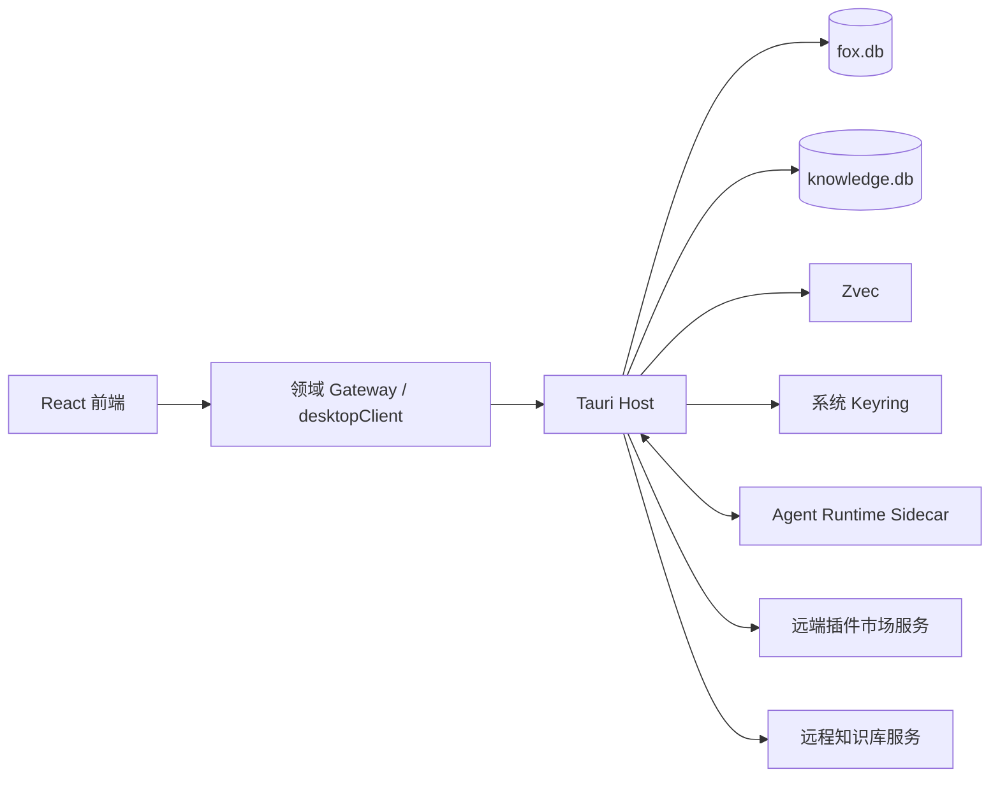
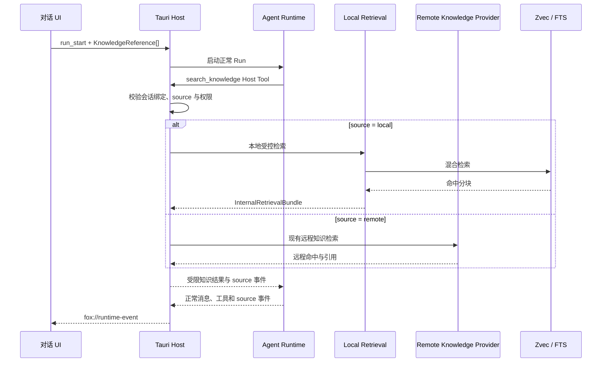

# 插件中心与本地知识库改造方案

> 状态：已归档；插件中心与本地知识工作区首版已实现<br>
> 适用版本：Fox `0.1.x` 后续迭代<br>
> 维护范围：插件中心、本地知识库、Tauri Host、Agent Runtime、插件市场服务<br>
> 最后更新：2026-08-24

## 目标与结论

本方案用于支持前端、Tauri Host、Agent Runtime 和远端插件市场分开开发，并在不破坏 Fox 当前安全边界和数据事实源的前提下完成两项改造：

1. 将现有 MCP、Skills 和内建工具管理升级为统一插件中心。
2. 新增完全本地化的知识工作区，支持文档管理、本地向量化、混合检索、对话引用和后续知识图谱。

已确认的核心决策：

- 顶部“助手 / 知识”是工作空间切换，不再通过选择远程 Agent 模拟知识模式。
- 助手工作空间中的现有知识入口统一称“远程知识库”，保持知识库服务只读访问边界。
- SQLite 继续作为本地产品事实源；`fox.db` 保存全局产品状态和绑定，独立的 `knowledge.db` 保存本地知识领域事实，Zvec 只保存可重建索引。
- 本地向量数据库默认采用 **Zvec**，通过 `VectorStore` 接口隔离具体实现；不再以 LanceDB 作为默认方案。
- 本地知识问答必须进入现有 Agent Runtime 对话链路，不建设第二套独立 LLM 调用和消息系统。
- 插件中心复用现有 MCP、Skill 和 Runtime Tool Catalog，不新建相互冲突的执行体系。
- 所有系统权限、文件、凭据、MCP 和本地检索仍由 Tauri Host 收口。

## 范围与非目标

### 本期范围

- 插件中心导航、列表、搜索、分类、已安装管理和自定义导入。
- MCP、Skill、内建工具的统一展示和分类型管理。
- 本地知识库、文档导入、解析、分块、索引任务和路径迁移。
- Zvec 本地向量索引、本地 Embedding 模型和混合检索。
- 本地知识引用进入现有会话、专家和 Runtime。
- 官方插件市场的客户端契约、签名包安装和本地缓存。

### 非目标

- 第一阶段不允许安装任意 Host 可执行工具；第三方执行能力统一通过 MCP 接入。
- 第一阶段不支持修改远程知识库内容。
- 第一阶段不建设独立于现有会话系统的“知识库聊天记录”。
- 第一阶段不承诺知识图谱参与回答；图谱生成与图谱辅助检索放在后续阶段。
- 第一阶段不支持插件绕过 Host 直接访问 SQLite、Keyring、项目目录或任意网络地址。

## 系统边界

“后端”不能笼统指代所有非 React 代码。本项目按以下四层分工：



| 层级 | 负责 | 不负责 |
| --- | --- | --- |
| React 前端 | 页面、组件、交互状态、Mock Gateway、事件投影 | 直接访问文件、凭据、Zvec、远端私有接口 |
| Tauri Host | SQLite、文件、Keyring、插件安装、MCP、索引、Zvec、权限和事件 | 模型循环、页面状态 |
| Agent Runtime | 模型循环、Prompt 组合、工具请求、知识上下文消费 | 直接访问 Zvec、SQLite、Keyring 或任意文件 |
| 远端插件市场 | 插件目录、版本、签名包、兼容信息和下架状态 | 本地安装状态、用户凭据、MCP 进程 |

代码目录所有权按以下方式划分，跨目录修改需由对应负责人共同审查：

| 责任方 | 主要写入范围 |
| --- | --- |
| 前端 | `apps/desktop/src/features/plugins`、`apps/desktop/src/features/local-knowledge`、`apps/desktop/src/features/workspace`、相关样式与前端测试 |
| Tauri Host | `apps/desktop/src-tauri/src/commands`、`database`、计划新增的 `plugin_center` 与 `local_knowledge` 模块 |
| Agent Runtime | `services/agent-runtime/src`、Runtime 协议与契约测试 |
| 远端插件市场 | 独立服务和部署目录；在仓库位置确定前不得把市场业务写入 Tauri Command |

## 前后端并行开发规则

### 契约先行

双方开始开发前必须冻结以下内容：

1. 命令名、Request、Response 和稳定错误码。
2. 长任务的 Operation、Job 和事件 Envelope。
3. `PluginCardView`、`KnowledgeReference`、`RetrievalResult`、`RetrievalDiagnostics` 等共享 DTO。
4. Mock JSON 和空状态、错误状态、处理中状态样本。
5. Schema 版本和兼容策略。

前端组件不得直接调用 `invoke`，统一通过领域 Gateway 调用 `desktopClient`。建议结构：

```text
apps/desktop/src/features/plugins/api/
├── plugin-gateway.ts
├── desktop-plugin-gateway.ts
└── mock-plugin-gateway.ts

apps/desktop/src/features/local-knowledge/api/
├── local-knowledge-gateway.ts
├── desktop-local-knowledge-gateway.ts
└── mock-local-knowledge-gateway.ts
```

Mock Gateway 与 Desktop Gateway 必须返回同一 DTO，不允许页面依赖 Mock 专用字段。

### 通用响应

新命令沿用当前 `ApiResponse<T>`：

```ts
type ApiResponse<T> =
  | { ok: true; data: T }
  | {
      ok: false
      error: {
        code: string
        message: string
        retryable: boolean
        details?: Record<string, unknown>
      }
    }
```

长任务不能只返回 `Result<()>`，必须先返回可关联的操作句柄：

```ts
type OperationAccepted = {
  operationId: string
  parentOperationId?: string
  acceptedAt: string
}

type Page<T> = {
  items: T[]
  nextCursor?: string
  total?: number
}
```

### 通用事件

插件安装、索引、模型下载和路径迁移统一使用可恢复事件：

```ts
type PluginOperationStage =
  | 'resolving'
  | 'downloading'
  | 'verifying'
  | 'extracting'
  | 'registering'

type KnowledgeOperationStage =
  | 'validating'
  | 'copying'
  | 'hashing'
  | 'parsing'
  | 'chunking'
  | 'embedding'
  | 'vector_upsert'
  | 'verifying'
  | 'committing'

type ModelOperationStage =
  | 'resolving'
  | 'downloading'
  | 'copying'
  | 'verifying'
  | 'registering'

type MigrationOperationStage =
  | 'validating'
  | 'quiescing'
  | 'flushing'
  | 'closing_handles'
  | 'copying'
  | 'verifying'
  | 'switching'
  | 'reopening'
  | 'self_checking'
  | 'awaiting_cleanup'
  | 'rolling_back'

type OperationEvent = {
  schemaVersion: number
  operationId: string
  parentOperationId?: string
  sequence: number
  domain: 'plugin' | 'knowledge' | 'model' | 'migration'
  entityId?: string
  operation: string
  status: 'queued' | 'running' | 'paused' | 'completed' | 'failed' | 'cancelled'
  stage?:
    | PluginOperationStage
    | KnowledgeOperationStage
    | ModelOperationStage
    | MigrationOperationStage
  progress?: number
  data?: {
    completedItems?: number
    succeededItems?: number
    failedItems?: number
    totalItems?: number
    processedBytes?: number
    totalBytes?: number
    resultEntityId?: string
    outcome?: 'success' | 'partial'
    [key: string]: unknown
  }
  error?: {
    code: string
    message: string
    retryable: boolean
  }
  occurredAt: string
}
```

`progress` 必须是 `0` 至 `100` 的整数。`data` 最大序列化尺寸为 16 KB，只能传递进度指标和结果引用，禁止包含文档正文、插件密钥、绝对敏感路径或任意大对象。

事件只负责低延迟更新。Operation/Job 的 SQLite 快照必须持久化 `last_sequence`，每次状态更新在同一事务中递增序号并保存快照，再发布事件。前端刷新、事件丢失或重新订阅后，必须通过 Operation/Job 查询命令读取 `lastSequence` 和最终状态。Listener 卸载时必须执行 `UnlistenFn`。

## 插件中心

### 产品结构

助手主侧栏新增“插件”入口，页面与专家、知识库一样直接呈现在右侧工作区，不进入设置侧栏。Fox 当前使用 `WorkspaceView` 导航，不引入另一套 React Router 路由。

插件中心顶部包含：

- 标题行右侧只放置搜索框。
- 下一行从左到右依次放置三段胶囊 `MCP 服务 / Skills / 工具`、分类筛选、“已安装”、“添加插件”和刷新；滚动区固定预留垂直滚动条占位，切换标签时不得产生横向抖动。
- 页面和区块仅使用黑色主标题，不增加蓝色英文 Kicker 与标题下注释。
- “已安装”入口。
- “添加插件”入口，包含手动 MCP、导入 Skill 和导入本地插件包。

内容区包含：

- 官方精选。
- 分类列表。
- 本地已安装状态。
- 来源标识：内建、官方、社区、本地。

第一阶段没有远端市场时，官方精选使用随应用发布的内建目录。远端市场上线后只替换 Catalog Provider，不改页面模型。

### 统一展示，不统一运行方式

```ts
type PluginKind = 'mcp' | 'skill' | 'tool'
type PluginOrigin = 'builtin' | 'official' | 'community' | 'local'

type PluginInstallStatus =
  | 'not_installed'
  | 'installing'
  | 'installed'
  | 'update_available'
  | 'uninstalling'
  | 'install_failed'

type McpRuntimeStatus =
  | 'unknown'
  | 'ready'
  | 'connecting'
  | 'healthy'
  | 'degraded'
  | 'error'

type PluginActivation =
  | { mode: 'global'; enabled: boolean }
  | { mode: 'per_agent'; enabledAgentCount: number }
  | { mode: 'not_applicable' }

type PluginActivationUpdate =
  | { mode: 'global'; enabled: boolean }
  | { mode: 'per_agent'; agentId: string; enabled: boolean }

type PluginCardView = {
  id: string
  kind: PluginKind
  origin: PluginOrigin
  name: string
  description: string
  icon?: string
  version?: string
  installStatus: PluginInstallStatus
  activation: PluginActivation
  runtimeStatus?: McpRuntimeStatus
  permissions: string[]
  compatible: boolean
  incompatibilityReason?: string
}
```

`PluginActivation` 是聚合后的只读状态，`PluginActivationUpdate` 是写入请求，两者不得混用。插件中心卡片只允许直接切换全局启用项；`per_agent` 项展示已启用 Agent 数量和“配置范围”入口，用户选定 Agent 后再提交带 `agentId` 的更新。`not_applicable` 仅展示运行时可用性或权限状态，不显示伪开关。

三类扩展共享 Catalog 和卡片 DTO，但运行方式不同：

| 类型 | 事实来源 | 生命周期 |
| --- | --- | --- |
| MCP | 现有 MCP Repository、Keyring 和 Host MCP Handler | 每次操作建立 stdio Session；后续可扩展 HTTP/SSE |
| Skill | Skill 目录与 Agent Runtime Config | 指令包，无独立进程 |
| Tool | `runtime-contract.mjs` 与 Host Handler | 内建能力，不允许外部替换 |

不得新建第二套 MCP 进程管理器。当前 MCP 是按操作启动 stdio 子进程，首版 UI 展示“启用状态、最近测试、最近调用健康状态”，不提供误导性的长期“启动 / 停止”按钮。未来支持持久 HTTP/SSE MCP 后，再增加连接管理状态。

### 数据模型

不使用单个 `plugins` 表复制 MCP、Skill 和 Tool 的真实状态。新增数据只保存统一目录与安装事实：

```sql
CREATE TABLE plugin_catalog_cache (
    plugin_id TEXT NOT NULL,
    version TEXT NOT NULL,
    kind TEXT NOT NULL,
    origin TEXT NOT NULL,
    manifest_json TEXT NOT NULL,
    package_hash TEXT,
    signature TEXT,
    fetched_at INTEGER NOT NULL,
    PRIMARY KEY (plugin_id, version)
);

CREATE TABLE plugin_installations (
    plugin_id TEXT PRIMARY KEY,
    installed_version TEXT NOT NULL,
    origin TEXT NOT NULL,
    install_status TEXT NOT NULL,
    install_path TEXT,
    package_hash TEXT,
    installed_at INTEGER NOT NULL,
    updated_at INTEGER NOT NULL,
    last_error_code TEXT,
    last_error_message TEXT
);

CREATE TABLE plugin_operations (
    id TEXT PRIMARY KEY,
    plugin_id TEXT,
    parent_operation_id TEXT,
    operation TEXT NOT NULL,
    status TEXT NOT NULL,
    stage TEXT CHECK(stage IN ('resolving', 'downloading', 'verifying', 'extracting', 'registering')),
    progress INTEGER CHECK(progress BETWEEN 0 AND 100),
    outcome TEXT CHECK(outcome IN ('success', 'partial')),
    data_json TEXT,
    last_sequence INTEGER NOT NULL DEFAULT 0,
    error_code TEXT,
    error_message TEXT,
    created_at INTEGER NOT NULL,
    updated_at INTEGER NOT NULL
);
```

启用状态继续由各类型 Adapter 写回当前事实源。`PluginCardView` 由 Catalog、Installation 和类型 Adapter 聚合得到。

市场安装的 MCP 需要与现有 `mcp_servers` 建立来源关联。计划通过数据库迁移增加：

```sql
ALTER TABLE mcp_servers ADD COLUMN catalog_plugin_id TEXT;
ALTER TABLE mcp_servers ADD COLUMN origin TEXT NOT NULL DEFAULT 'local';
CREATE INDEX idx_mcp_servers_catalog_plugin_id ON mcp_servers(catalog_plugin_id);
```

现有记录迁移为 `origin = 'local'`。使用 `catalog_plugin_id` 而不是 `plugin_id`，避免与 MCP Server 自身主键 `id` 混淆。

### MCP 生命周期

首版保持当前安全模型：

1. Host 读取已启用 MCP 配置和 Keyring 环境变量。
2. 每次 `tools/list` 或 `tools/call` 启动受控 stdio 子进程。
3. 完成初始化、请求和超时处理后回收进程。
4. 调用前继续执行工具声明校验、专家权限交集和审批。

MCP 卡片提供：

- 启用 / 禁用。
- 测试连接。
- 最近测试结果。
- 最近调用错误摘要。
- 配置和凭据更新。

只有未来 Fox 托管的持久 MCP 才提供启动、停止和重连。

### 安装与安全

官方插件包必须满足：

- Manifest 声明 ID、版本、类型、Fox 兼容范围、权限和入口。
- 包内容具有 SHA-256，Manifest 与包哈希由官方私钥签名。
- Host 使用内置公钥验证签名。
- 解压前检查路径穿越、绝对路径、符号链接、文件数量和总大小。
- 安装目录不可由前端任意指定。
- 官方包必须预打包运行依赖，不允许安装阶段执行普通 `npm install`、`postinstall` 或任意脚本。
- 自定义本地包标记为“不受信任”，首次启用时展示权限摘要。
- 密钥字段只允许写入、清空和判断是否已配置，不向前端回传明文。

Windows 安全检查必须额外覆盖：

- 同时把 `/` 和 `\` 视为路径分隔符，规范化后再判断目录穿越。
- 拒绝盘符绝对路径、UNC、`\\?\`、`\\.\`、NTFS ADS `:` 和跨卷目标。
- 拒绝 `CON`、`PRN`、`AUX`、`NUL`、`COM1` 至 `COM9`、`LPT1` 至 `LPT9` 等设备名及其带扩展名形式。
- 拒绝尾随空格、尾随句点、大小写折叠后冲突的文件名。
- 拒绝符号链接、硬链接、junction 和其他 reparse point。
- ZIP 最多 5,000 个条目、单文件解压后最多 128 MiB、总解压量最多 512 MiB、压缩比最多 100:1；不递归解压嵌套压缩包。

### 插件命令草案

| 命令 | 返回 | 说明 |
| --- | --- | --- |
| `plugin_catalog_list` | `Page<PluginCardView>` | 聚合目录与本地状态，支持分类和搜索 |
| `plugin_detail_get` | `PluginDetailView` | 打开详情或配置时加载完整 Manifest、权限和版本 |
| `plugin_installations_list` | `PluginCardView[]` | 已安装抽屉 |
| `plugin_install_start` | `OperationAccepted` | 下载、验证、解压和注册 |
| `plugin_uninstall_start` | `OperationAccepted` | 停用后卸载 |
| `plugin_update_check` | `PluginUpdateInfo[]` | 批量检查可用更新 |
| `plugin_update_start` | `OperationAccepted` | 更新单个插件 |
| `plugin_operations_list` | `Page<PluginOperation>` | 恢复安装、卸载和更新任务 |
| `plugin_operation_get` | `PluginOperation` | 刷新和事件丢失恢复 |
| `plugin_operation_cancel` | `PluginOperation` | 取消仍可取消的操作 |
| `plugin_set_activation` | `PluginCardView` | 接收 `PluginActivationUpdate`，按 global/per-agent 类型更新事实源 |
| `plugin_config_get` | `PluginConfigView` | 敏感字段只返回 configured 状态 |
| `plugin_config_update` | `PluginCardView` | Host 校验并写入配置与 Keyring |
| `plugin_secret_set` | `PluginSecretState` | 只写密钥 |
| `plugin_secret_clear` | `PluginSecretState` | 清空密钥 |
| `plugin_permissions_get` | `PluginPermissionView` | 获取声明权限与实际授权 |
| `plugin_permissions_update` | `PluginPermissionView` | 更新允许范围，不能突破 Host 上限 |
| `plugin_import_start` | `OperationAccepted` | 导入文件夹或 ZIP |

现有 `mcp_server_*` 和 `skill_*` 命令可以继续作为底层命令；插件页面通过统一 Gateway 使用聚合命令，不要求一次性删除兼容接口。

## 本地知识库

### 产品边界

- 顶部“知识”进入本地知识工作区，不创建远程会话。
- 助手侧栏的现有入口改为“远程知识库”，继续访问知识库服务。
- 本地知识库允许创建、重命名、删除、导入文档、索引和调整存储位置。
- 远程知识库继续由服务端管理，Fox 不提供编辑入口。
- 本地与远程知识库使用统一引用类型，但由不同 Provider 执行。

```ts
type KnowledgeReference =
  | {
      source: 'local'
      id: string
      revision?: string
    }
  | {
      source: 'remote'
      connectionId: string
      id: string
      revision?: string
}
```

`revision` 的语义必须按 Provider 固定：本地引用写入当前 active generation 的单调递增 `sequence`，建议编码为 `generation:<sequence>`；远程引用仅在服务端明确提供知识库级 revision 时填写，否则省略，不能拿文档 `sourceRevision` 冒充知识库 revision。

新会话绑定和新专家包不能继续只保存裸知识库 ID，避免本地与远程 ID 冲突；但历史专家包快照必须保持不可变。当前 `ExpertPackageManifest.version?: string` 是作者填写的专家包语义化版本，不是 Schema 版本；存量 Manifest 没有 Schema 字段，因此读取兼容性必须以字段存在性判定，不能把 `version` 或不存在的 `schemaVersion` 当判据。

```ts
interface ExpertPackageManifest {
  version?: string
  manifestSchemaVersion?: number
  prompt?: string
  skills?: string[]
  knowledge?: string[]
  knowledgeReferences?: KnowledgeReference[]
  mcpServers?: string[]
  allowedTools?: string[]
  [key: string]: unknown
}

type ResolvedExpertKnowledgeDeclaration =
  | { format: 'references'; references: KnowledgeReference[] }
  | { format: 'legacy_remote_ids'; ids: string[] }
  | { format: 'empty' }
```

兼容规则固定为：

- 读取时若存在 `knowledgeReferences` 字段，必须按 `KnowledgeReference[]` Runtime Guard 校验并按新格式解析；空数组仍表示新格式，字段类型错误时返回契约错误，不能静默回退。
- 否则若存在 `knowledge` 字段，则只接受字符串数组并按历史远程知识 ID 解析；Host 结合原有远程连接上下文补全 `connectionId`，无法唯一确定连接时标记为未解析，不能猜成本地知识库。
- 两个字段都不存在时解析为空；`manifestSchemaVersion` 只用于新写入、自描述和校验，不作为读取时的唯一分流条件。
- 新建或重新保存的专家包固定写入 `manifestSchemaVersion: 2` 和 `knowledgeReferences`，不再写入新的 `knowledge` 裸 ID；`version` 继续独立表达专家包语义版本。
- `ExpertPackageManifest` 已有 `[key: string]: unknown`，旧 TypeScript 读取端会容忍新增字段，这是新旧格式并存不破坏编译的依据；但所有新读取路径仍必须执行 Runtime Guard。
- Host/Runtime 与前端共同使用同一组字段判定 Fixture。`workbench.tsx` 当前直接读取 `packageManifest.knowledge` 的路径必须改为共享 `resolveExpertKnowledgeDeclaration`；专家编辑器、专家卡片和会话绑定预览也禁止各自重复实现判定，否则 v2 专家会显示为空。
- 会话实际可用范围以 `knowledge_bindings_v2` 和绑定快照为准，Manifest 只表达专家声明，不绕过会话绑定和 Host 权限校验。
- 历史 `package_snapshot_json` 不重写、不重新计算 Hash。若未来迁移确实需要改写，必须在同一事务重算 `package_hash`，并用历史绑定 Fixture 验证旧会话仍可运行；本阶段默认不执行该改写。

历史 Fixture 不能手写。P0 在修改序列化逻辑前，由当前生产 `agent_package_snapshot` 和 `package_snapshot_hash` 对一组代表性存量专家生成并提交到 `apps/desktop/src-tauri/tests/fixtures/expert-packages/v1/`，至少包含原始 Agent 输入、精确 compact snapshot 字节和对应 Hash。Fixture 记录生成代码的 Git Commit；后续兼容测试使用这些固定产物，不能用新实现覆盖重生成后再自证兼容。

本地和远程知识库的产品定位如下：

| 维度 | 本地知识库 | 远程知识库 |
| --- | --- | --- |
| 数据位置 | 用户设备受管目录 | 知识库服务 |
| 是否可编辑 | 可创建、导入、删除、重建索引 | Fox 内只读访问，编辑由服务端完成 |
| 离线能力 | 文档、索引和检索可离线 | 依赖服务连接和登录 |
| 向量化 | 本地 ONNX Embedding + Zvec | 由远端服务决定 |
| 适用场景 | 私人资料、项目文档、离线知识 | 团队共享、组织知识、服务端治理 |
| 会话绑定 | `source=local` | `source=remote + connectionId` |
| 隐私提示 | 本地检索；发送给云端模型时提示数据出境 | 按远端服务和模型策略处理 |

### 双 SQLite 职责

本方案采用两个 SQLite 文件隔离故障域和迁移范围：

| 数据库 | 保存内容 |
| --- | --- |
| `fox.db` | 会话、Agent、知识绑定、插件安装、全局 Operation 投影和用户设置 |
| `knowledge.db` | 本地知识库、文档、修订、chunk、索引 Job、索引代次、模型状态和路径迁移 |

约束：

- 两个数据库之间不建立 SQLite 外键，只通过稳定 ID 形成逻辑引用。
- `knowledge_bindings` 保存在 `fox.db`；绑定加载时由 Host 校验 `knowledge.db` 中的目标仍存在。
- 跨数据库更新采用可恢复 Operation，不假装存在跨库事务。
- 备份清单同时记录两个 SQLite 的 Schema 版本和文件哈希；只恢复其中一个时必须执行绑定对账。
- 引入第二个产品事实库会扩展现有 ADR 0001 的边界，P0 必须新增或更新架构决策并通过评审后才能实施。

现有 `knowledge_bindings` 强制关联远程 `service_connection_id`，不能直接保存本地绑定。迁移后采用 `source + connection_id + knowledge_base_id`：远程引用必须提供 `connection_id`，本地引用使用内部 provider key `local`，对外 DTO 不暴露伪连接 ID。现有记录全部迁移为 `source = 'remote'`，并保留原 `service_connection_id`。

```sql
CREATE TABLE knowledge_bindings_v2 (
    id TEXT PRIMARY KEY,
    conversation_id TEXT NOT NULL REFERENCES conversations(id) ON DELETE CASCADE,
    source TEXT NOT NULL CHECK(source IN ('local', 'remote')),
    provider_key TEXT NOT NULL,
    connection_id TEXT,
    knowledge_base_id TEXT NOT NULL,
    knowledge_base_name TEXT,
    enabled INTEGER NOT NULL DEFAULT 1,
    created_at INTEGER NOT NULL,
    updated_at INTEGER NOT NULL,
    CHECK(
        (source = 'local' AND provider_key = 'local' AND connection_id IS NULL) OR
        (source = 'remote' AND connection_id IS NOT NULL AND provider_key = connection_id)
    ),
    UNIQUE(conversation_id, source, provider_key, knowledge_base_id)
);
```

迁移必须在事务中复制旧表、校验行数和唯一键、替换表并重建索引；运行期不得同时维护两套绑定表。

### 存储结构

默认目录使用 Tauri `appDataDir`，不使用安装目录：

```text
<app-data>/local-knowledge/
├── knowledge.db
├── models/
│   └── <embedding-model-id>/
├── indexes/
│   └── <knowledge-base-id>/
│       └── <generation-id>/
├── knowledge-bases/
│   └── <knowledge-base-id>/documents/
└── staging/
```

SQLite 保存知识库、文档、文档修订、分块、任务、索引代次、模型状态和迁移状态。Zvec 只保存可重建的检索索引。

### 核心表

```sql
CREATE TABLE local_knowledge_bases (
    id TEXT PRIMARY KEY,
    name TEXT NOT NULL,
    description TEXT,
    active_index_generation TEXT,
    created_at INTEGER NOT NULL,
    updated_at INTEGER NOT NULL
);

CREATE TABLE local_kb_documents (
    id TEXT PRIMARY KEY,
    knowledge_base_id TEXT NOT NULL,
    display_name TEXT NOT NULL,
    relative_path TEXT NOT NULL,
    source_path TEXT,
    current_revision INTEGER NOT NULL DEFAULT 1,
    content_hash TEXT NOT NULL,
    file_size INTEGER NOT NULL,
    mime_type TEXT NOT NULL,
    parse_status TEXT NOT NULL,
    index_status TEXT NOT NULL,
    parser_version TEXT,
    chunk_config_hash TEXT,
    embedding_model_id TEXT,
    last_error_code TEXT,
    last_error_message TEXT,
    created_at INTEGER NOT NULL,
    updated_at INTEGER NOT NULL,
    FOREIGN KEY (knowledge_base_id) REFERENCES local_knowledge_bases(id) ON DELETE CASCADE
);

CREATE TABLE local_kb_chunks (
    row_id INTEGER PRIMARY KEY AUTOINCREMENT,
    id TEXT NOT NULL UNIQUE,
    document_id TEXT NOT NULL,
    document_revision INTEGER NOT NULL,
    chunk_index INTEGER NOT NULL,
    text TEXT NOT NULL,
    page_number INTEGER,
    start_offset INTEGER,
    end_offset INTEGER,
    metadata_json TEXT,
    FOREIGN KEY (document_id) REFERENCES local_kb_documents(id) ON DELETE CASCADE
);

CREATE TABLE local_kb_index_generations (
    id TEXT PRIMARY KEY,
    knowledge_base_id TEXT NOT NULL,
    sequence INTEGER NOT NULL,
    status TEXT NOT NULL CHECK(status IN ('staging', 'active', 'stale', 'deleting', 'failed')),
    vector_store_kind TEXT NOT NULL,
    vector_store_version TEXT,
    embedding_model_id TEXT NOT NULL,
    dimension INTEGER NOT NULL CHECK(dimension > 0),
    chunk_config_hash TEXT NOT NULL,
    parser_version TEXT NOT NULL,
    chunk_count INTEGER NOT NULL DEFAULT 0,
    created_at INTEGER NOT NULL,
    activated_at INTEGER,
    retire_after INTEGER,
    last_error_code TEXT,
    last_error_message TEXT,
    FOREIGN KEY (knowledge_base_id) REFERENCES local_knowledge_bases(id) ON DELETE CASCADE,
    UNIQUE(knowledge_base_id, sequence)
);

CREATE UNIQUE INDEX idx_local_kb_one_active_generation
ON local_kb_index_generations(knowledge_base_id)
WHERE status = 'active';

CREATE TABLE local_kb_jobs (
    id TEXT PRIMARY KEY,
    parent_operation_id TEXT,
    knowledge_base_id TEXT NOT NULL,
    job_type TEXT NOT NULL CHECK(job_type IN ('import', 'parse', 'index', 'rebuild', 'delete')),
    status TEXT NOT NULL CHECK(status IN ('queued', 'running', 'paused', 'completed', 'failed', 'cancelled', 'interrupted')),
    stage TEXT CHECK(stage IN ('validating', 'copying', 'hashing', 'parsing', 'chunking', 'embedding', 'vector_upsert', 'verifying', 'committing')),
    progress INTEGER NOT NULL DEFAULT 0 CHECK(progress BETWEEN 0 AND 100),
    retry_count INTEGER NOT NULL DEFAULT 0,
    last_sequence INTEGER NOT NULL DEFAULT 0,
    outcome TEXT CHECK(outcome IN ('success', 'partial')),
    data_json TEXT,
    generation_id TEXT,
    heartbeat_at INTEGER,
    checkpoint_json TEXT,
    error_code TEXT,
    error_message TEXT,
    created_at INTEGER NOT NULL,
    started_at INTEGER,
    updated_at INTEGER NOT NULL,
    completed_at INTEGER,
    FOREIGN KEY (knowledge_base_id) REFERENCES local_knowledge_bases(id) ON DELETE CASCADE
);

CREATE UNIQUE INDEX idx_local_kb_single_active_index_job
ON local_kb_jobs(knowledge_base_id)
WHERE job_type IN ('index', 'rebuild')
  AND status IN ('queued', 'running', 'paused');

CREATE TABLE local_kb_storage_migrations (
    id TEXT PRIMARY KEY,
    source_path TEXT NOT NULL,
    destination_path TEXT NOT NULL,
    status TEXT NOT NULL,
    stage TEXT NOT NULL CHECK(stage IN ('validating', 'quiescing', 'flushing', 'closing_handles', 'copying', 'verifying', 'switching', 'reopening', 'self_checking', 'awaiting_cleanup', 'rolling_back')),
    progress INTEGER NOT NULL DEFAULT 0 CHECK(progress BETWEEN 0 AND 100),
    last_sequence INTEGER NOT NULL DEFAULT 0,
    error_code TEXT,
    error_message TEXT,
    created_at INTEGER NOT NULL,
    updated_at INTEGER NOT NULL
);
```

文档使用 `parse_status/index_status` 和版本字段，不使用单个 `indexed BOOLEAN`。修改文档、分块配置或 Embedding 模型后，旧索引标记为 stale，并创建新的索引代次。`local_knowledge_bases.active_index_generation` 与 `local_kb_index_generations.status = 'active'` 必须在同一 SQLite 事务切换，部分唯一索引保证每个知识库最多一个 active generation。

运行中的 Job 至少每 30 秒更新一次 `heartbeat_at` 和可幂等恢复的 `checkpoint_json`。应用启动时，`status = 'running'` 且心跳超过 120 秒未更新的 Job 转为 `interrupted`：解析器和 VectorStore 支持批次幂等恢复时从 checkpoint 继续，否则将对应 staging generation 标记为 `failed` 或 `stale`，保留原 active generation，并创建新的重试 Job。任何情况下都不能把未知完整性的 staging generation 激活。

### 文档导入和解析

桌面产品使用“导入”而不是“上传”术语。默认将文件复制到受管知识目录，避免源文件移动或权限变化导致索引失效。

首版支持范围：

- 文本：TXT、Markdown。
- 办公文档：PDF、DOCX、PPTX。
- 表格：XLSX 先提取工作表文本和结构化单元格，复杂公式与图表解析后续增强。

每次导入执行：

1. 校验文件类型、大小、文件名和路径。
2. 复制到 staging 并计算 SHA-256。
3. 原子移动到受管目录。
4. 写入 SQLite 文档事实。
5. 创建解析和索引 Job。

批量导入使用一个父 Operation 和每个文件一个子 Operation，子事件通过 `parentOperationId` 归组。父 Operation 的终态规则固定为：全部成功时 `completed + outcome=success`；部分成功时 `completed + outcome=partial` 并返回 `succeededItems/failedItems`；全部失败时才使用 `failed`。前端不得把部分成功伪装成整批失败，也不得因单个文件失败让其他文件停止解析。

解析器必须输出统一结构，至少包含正文、页码或幻灯片号、段落位置和表格来源，确保引用可以跳回原文件位置。

### Zvec 向量索引

#### 选型

本地向量数据库默认采用 [Zvec](https://github.com/alibaba/zvec)：

- 进程内嵌入，不要求用户部署数据库服务。
- 支持 Windows、macOS 和 Linux。
- 提供 Rust SDK，适合由 Tauri Host 直接调用。
- 支持 Dense Vector、Sparse Vector、全文和混合检索能力。
- Windows 动态库可以随 Fox 安装包离线分发。

Zvec 不负责生成向量。Embedding 仍由本地模型完成。

#### 抽象接口

```rust
pub trait VectorStore {
    fn create_generation(&self, knowledge_base_id: &str, generation_id: &str) -> Result<()>;
    fn upsert(&self, generation_id: &str, records: &[VectorRecord]) -> Result<()>;
    fn search(&self, generation_id: &str, request: VectorSearchRequest) -> Result<Vec<VectorHit>>;
    fn flush(&self, generation_id: &str) -> Result<()>;
    fn verify(&self, generation_id: &str) -> Result<VectorStoreCheck>;
    fn delete_generation(&self, generation_id: &str) -> Result<()>;
}
```

首个生产实现为 `ZvecVectorStore`。测试使用内存实现，避免单元测试依赖本机动态库。业务层不得直接依赖 Zvec 类型。

#### 打包

- `zvec_c_api.dll` 等平台动态库作为 Tauri Resource 随安装包发布。
- 构建阶段可以下载受版本锁定的预编译依赖，运行阶段禁止联网下载动态库。
- 发布清单记录 Zvec 版本、文件哈希、许可证和目标架构。
- Host 启动时执行版本和动态库自检；失败时关闭向量索引能力，但不能阻止 Fox 打开已有非向量数据。
- 首版至少支持 Windows x64；其他平台必须经过独立打包验证后标记可用。

#### P0 技术验证门槛

正式锁定 Zvec 前必须通过：

1. Windows x64 离线安装、启动、创建、写入、查询和重开。
2. 应用异常退出后的索引重开与完整性检查。
3. 10 万及 100 万分块的索引时间、峰值内存、磁盘和查询延迟测试。
4. 中文语义检索、全文检索和混合检索质量测试。
5. 知识根目录复制迁移后的索引重开测试。
6. Zvec Rust SDK 与动态库版本兼容、许可证和发布清单检查。

量化门槛使用 Windows 11 x64、8 逻辑核心、16 GiB 内存、NVMe、CPU-only 的参考设备，Embedding 输入按最多 512 Token 的 chunk 统计。每项至少重复 3 次，记录中位数和 P95；GitHub 托管 Runner 只运行 Smoke，不作为性能裁决设备。

| 指标 | 通过门槛 |
| --- | --- |
| ONNX Embedding 吞吐 | 不低于 8 chunks/s，峰值进程内存不高于 2.5 GiB |
| ONNX 取消响应 | P95 不超过 2 秒 |
| 10 万向量 Zvec 构建 | 不含 Embedding 不超过 10 分钟，峰值内存不超过 2 GiB |
| 10 万向量查询 | Top-10 查询 P95 不超过 100 ms，重开不超过 5 秒 |
| 100 万向量 Zvec 构建 | 不含 Embedding 不超过 90 分钟，峰值内存不超过 4 GiB |
| 100 万向量查询 | Top-10 查询 P95 不超过 250 ms，重开不超过 15 秒 |
| 100 万向量索引体积 | `index_size_bytes / (vector_count * dimension) <= 16`；512 维参考集同时不超过 8 GiB |
| 召回质量 | 相对独立暴力精确检索基线的 Recall@10 不低于 0.90 |
| 10 万 chunk 完整流水线 | 解析、Embedding、写入和提交代次不超过 5 小时 |
| 崩溃恢复 | 不激活半成品 generation，启动后 30 秒内完成状态判定或进入明确恢复提示 |

任一 Must-pass 指标连续三次不达标，Zvec 选型不得进入 P1，应重新评估索引参数或备用 `VectorStore` 实现。

数字自洽基线：`100,000 / 8 chunks/s` 约为 3 小时 28 分，5 小时完整流水线门槛仍保留约 1 小时 32 分用于解析、Zvec 构建、校验和代次提交；若实测无法保留该余量，应提高 Embedding 吞吐门槛，而不是放宽完整流水线门槛。

检索质量使用版本化基准集 `benchmarks/local-knowledge/retrieval/zh-v1/`：至少 200 条中文查询，覆盖首版全部文档格式，保存预期文档 ID、chunk ID 和位置，不包含用户私有数据。精确基线由独立测试程序直接读取保存的 `f32` 向量并执行暴力余弦检索，不能调用 Zvec 的另一种索引模式冒充 Ground Truth。每次报告记录数据集版本、模型版本、维度、chunk 配置、冷/热启动条件和三次重复结果。

若 Zvec 原生中文全文检索未达到基线，保留 SQLite FTS5 作为关键词通道；向量索引仍使用 Zvec。

### 索引一致性

SQLite 与 Zvec 无法共享数据库事务，因此采用“索引代次”提交：

1. SQLite 创建 `generation_id` 和 Job。
2. 解析、分块并将 chunk 事实写入 SQLite。
3. 将同一批 `chunk_id + generation_id` 写入 Zvec staging generation。
4. Flush 后校验数量、维度、模型 ID 和抽样检索。
5. SQLite 事务将 `active_index_generation` 切换到新代次。
6. 延迟清理旧代次。

任何中途失败都不得切换 active generation。启动恢复时清理或继续未完成 staging generation。

### 本地 Embedding 模型

默认候选为 `bge-small-zh-v1.5` 的 ONNX 版本，但模型管理与向量数据库分离：

```ts
type EmbeddingModelState = {
  modelId: string
  version: string
  dimension: number
  status: 'not_installed' | 'installing' | 'ready' | 'error'
  sizeBytes?: number
  error?: string
}

type EmbeddingModelInstallRequest =
  | {
      mode: 'offline'
      packagePath: string
    }
  | {
      mode: 'download'
      modelId: string
      version: string
    }
```

`offline` 只接受文件选择器返回的受控路径；`download` 只允许从 Fox 配置的官方模型目录下载。两种模式进入同一 Operation 状态机。

模型包必须包含版本、维度、Tokenizer、文件哈希和许可证信息。模型变更后不得复用维度或模型不同的旧索引。P0 还必须验证 ONNX Runtime 的 Windows x64 离线打包：运行库、Tokenizer、模型和 Execution Provider 依赖随安装包或受签名模型包发布，不依赖系统 PATH，不在应用首次启动时隐式下载。

### 混合检索

首版检索流程：

1. 本地模型生成 Query Embedding。
2. Zvec Dense Vector 检索。
3. Zvec 全文检索；中文效果不足时使用 SQLite FTS5。
4. 使用 Reciprocal Rank Fusion 合并排名，不能直接混合不同来源的原始 score。
5. 按 `chunk_id` 去重，并执行知识库、文档、权限和状态过滤。
6. 可选本地 Reranker。
7. 返回带来源位置的 `RetrievalResult`；检索诊断只写入 Host 诊断和 Run Request Snapshot。

```ts
type RetrievalResult = {
  retrievalId: string
  query: string
  knowledgeReferences: KnowledgeReference[]
  hits: Array<{
    knowledgeBaseId: string
    documentId: string
    chunkId: string
    fileName: string
    pageNumber?: number
    slideNumber?: number
    anchor?: string
    text: string
    rank: number
    score?: number
  }>
}

type RetrievalDiagnostics = {
  retrievalId: string
  denseCount: number
  keywordCount: number
  fusedCount: number
  generationId: string
  embeddingModelId: string
  embeddingDurationMs: number
  searchDurationMs: number
  rerankDurationMs?: number
}

type InternalRetrievalBundle = {
  result: RetrievalResult
  diagnostics: RetrievalDiagnostics
}
```

Host 为每次检索生成稳定 `retrievalId`，同时写入结果与诊断；持久化诊断记录可额外关联内部 `runId/toolCallId`，但 Runtime 不需要接收这些内部字段。Runtime 只接收 `RetrievalResult`。`RetrievalDiagnostics` 不进入模型上下文，避免无关内部信息占用 Token 或泄漏实现细节。

### 对话与 Runtime 集成

不实现 `ask_local_kb -> LLMClient.complete` 的独立链路。正确流程：



这样可以继续复用：

- 专家 Prompt Overlay。
- 工具权限交集。
- 流式消息和取消。
- `source.added` 引用卡片。
- Run 诊断、请求快照、重试和恢复。

知识工作区中的“问答”按钮应创建或打开一个绑定该本地知识库的正常会话。

Runtime 已有 `list_knowledge_bases`、`search_knowledge`、`read_knowledge_document` 和 `query_knowledge_graph`，不得再新增 `list_local_knowledge_bases` / `search_local_knowledge` 形成重复语义，也不能让已保存专家的 `allowedTools` 失效。P4 采用 source-aware 扩展：

- `list_knowledge_bases` 返回当前会话已绑定且仍可用的 `KnowledgeReference`，不允许枚举用户全部本地或远程知识库。
- `search_knowledge` 请求携带一个或多个 `KnowledgeReference`、query、topK 和可选 document filters；Host 根据 `source` 分发到本地 Provider 或现有远程 Provider。
- `read_knowledge_document` 在需要读取命中上下文时同样接收 source-aware 引用。
- `query_knowledge_graph` 在 P6 前保持远程 Provider 行为；收到 `source = 'local'` 必须返回 `local_knowledge.graph_unavailable`，不能静默返回空图让模型误判为“没有关系”。P6 再增加本地 Provider。
- `runtime-contract.mjs`、`host-tools.mjs`、Rust Handler、Capability Manifest 和契约测试同步扩展参数与返回值，同时保留现有工具名和旧远程请求兼容分支。

```ts
type KnowledgeBaseToolView = {
  reference: KnowledgeReference
  name: string
  available: boolean
}

type SearchKnowledgeRequest = {
  query: string
  targets?: KnowledgeReference[]
  topK?: number
  documentIds?: string[]
}
```

`targets` 省略时只搜索当前会话全部已启用绑定；传入时仍与绑定范围取交集。模型不能在参数中提供 `conversationId`、绝对路径或伪造 Provider，Run 上下文由 Host 注入并作为唯一授权依据。

自动 RAG 可以由 Prompt/Runtime 策略调用 `search_knowledge`，但不能绕过同一 Host 权限和绑定检查。Runtime 只调用 Host Tool，不直接调用任何 Tauri `local_knowledge_*` 命令。

### 路径迁移

迁移是持久化 Operation，不是一次文件复制函数：

1. `validating`：验证目标目录、权限、可用空间、目标是否为空及是否位于禁止目录，并在 SQLite 写入 migration 记录。
2. `quiescing`：拒绝新导入、检索和索引调度，等待活动任务到达安全点；无法安全暂停的任务先取消并持久化 checkpoint。
3. `flushing`：提交 `knowledge.db` 事务和 WAL checkpoint，Flush 所有 Zvec generation，等待 ONNX 推理批次结束或取消。
4. `closing_handles`：显式关闭 `knowledge.db` 连接池、Zvec 句柄、模型文件和 ONNX Session；Windows 下在任何复制、重命名或删除前验证目录内无 Fox 持有的文件句柄。
5. `copying`：复制到目标目录中的 staging 目录，不修改当前配置。
6. `verifying`：校验文件哈希、SQLite integrity、generation 元数据和模型文件；只允许用临时只读句柄验证，并在进入下一阶段前再次关闭。
7. `switching`：在目标卷内原子重命名 staging 目录，再原子更新 Fox 配置指向新目录。
8. `reopening`：按新路径重新打开 SQLite、Zvec 和模型。
9. `self_checking`：完成知识库列表、索引重开、模型加载和最小读写自检后恢复任务。
10. `awaiting_cleanup`：保留旧目录，用户确认或宽限期结束后再清理。

回退策略以 `switching` 为边界：切换前失败时删除目标 staging、重新打开源路径并恢复调度；切换后自检失败时进入 `rolling_back`，只要源目录完整就原子恢复旧配置并重新打开源句柄。若源目录也不可用，则写入 `local_knowledge.migration_recovery_required` 并进入可操作的恢复页面，禁止永久 loading。应用启动时发现未完成迁移，必须根据持久化 stage、源目录和目标目录状态继续或回退。

### 本地知识命令草案

| 命令 | 返回 | 说明 |
| --- | --- | --- |
| `local_knowledge_bases_list` | `LocalKnowledgeBase[]` | 本地知识库列表 |
| `local_knowledge_source_folder_pick` | `string \| null` | 选择需要纳入本地文件管理的普通文件夹 |
| `local_knowledge_file_sources_list` | `LocalKnowledgeFileSource[]` | 已选择的文件来源、扫描时间与统计 |
| `local_knowledge_file_source_add` | `LocalKnowledgeFileSource` | 登记并扫描文件夹，不移动原文件 |
| `local_knowledge_file_source_rescan` | `LocalKnowledgeFileSource` | 重新构建指定来源的目录缓存 |
| `local_knowledge_file_source_remove` | `boolean` | 取消管理并清理缓存，不删除用户文件 |
| `local_knowledge_local_files_list` | `LocalKnowledgeCatalogFile[]` | 按来源、关键词和类型查询本地文件目录 |
| `local_knowledge_base_get` | `LocalKnowledgeBaseDetail` | 详情、统计、能力和活动 Job 的聚合快照 |
| `local_knowledge_base_create` | `LocalKnowledgeBase` | 新建 |
| `local_knowledge_base_update` | `LocalKnowledgeBase` | 重命名和描述 |
| `local_knowledge_base_delete_start` | `OperationAccepted` | 删除文档和索引 |
| `local_knowledge_documents_list` | `Page<KnowledgeDocument>` | 分页文件列表 |
| `local_knowledge_documents_search` | `Page<KnowledgeDocument>` | 按名称、类型和状态搜索 |
| `local_knowledge_document_get` | `KnowledgeDocumentDetail` | 解析、索引、版本和错误详情 |
| `local_knowledge_document_chunks_list` | `Page<KnowledgeChunkView>` | chunk 预览与引用定位 |
| `local_knowledge_document_preview_get` | `KnowledgePreviewDescriptor` | 复用预览器需要的受管文件描述 |
| `local_knowledge_document_source_open` | `boolean` | 通过 Host 打开受管原文件 |
| `local_knowledge_documents_import_start` | `OperationAccepted` | 导入一个或多个文件 |
| `local_knowledge_document_delete_start` | `OperationAccepted` | 删除并重建索引代次 |
| `local_knowledge_index_start` | `OperationAccepted` | 创建索引 Job |
| `local_knowledge_jobs_list` | `KnowledgeJob[]` | 状态恢复与任务中心 |
| `local_knowledge_job_get` | `KnowledgeJob` | 查询 `lastSequence` 与终态 |
| `local_knowledge_job_cancel` | `KnowledgeJob` | 取消 |
| `local_knowledge_job_retry` | `KnowledgeJob` | 重试 |
| `local_knowledge_retrieve` | `RetrievalResult` | 仅供知识页面手动测试和诊断；Runtime 使用现有 `search_knowledge` Host Tool |
| `local_knowledge_retrieval_diagnostics_get` | `RetrievalDiagnostics` | 接收 `retrievalId`，仅诊断页面使用 |
| `local_knowledge_config_get` | `LocalKnowledgeConfig` | 存储与模型配置 |
| `local_knowledge_storage_status` | `LocalKnowledgeStorageStatus` | 路径、空间、可写性和迁移状态 |
| `local_knowledge_storage_directory_pick` | `PickedDirectory` | Host 文件夹选择器，避免任意字符串路径 |
| `local_knowledge_storage_migrate_start` | `OperationAccepted` | 路径迁移 |
| `local_knowledge_storage_migration_get` | `StorageMigration` | 迁移事件丢失和重启恢复 |
| `local_embedding_models_list` | `EmbeddingModelState[]` | 可用、本地安装和兼容状态 |
| `local_embedding_model_get` | `EmbeddingModelState` | 模型状态 |
| `local_embedding_model_install_start` | `OperationAccepted` | 接收 offline/download 判别请求 |
| `local_embedding_model_remove_start` | `OperationAccepted` | 仅删除未被 active generation 使用的模型 |
| `local_embedding_model_operation_get` | `ModelOperation` | 按 Operation ID 恢复下载、安装或删除状态 |
| `local_embedding_model_operation_cancel` | `ModelOperation` | 取消仍可取消的模型操作，P95 响应不超过 2 秒 |

知识图谱命令在图谱阶段单独冻结，不提前占用首版契约。

列表接口必须聚合卡片所需状态并分页返回，禁止前端为每张插件卡片、每个知识库或每个文档再发一次状态请求。详情、chunk 和诊断只在用户打开对应界面时按需加载。

## 错误码契约

以下错误码是 P0 必须稳定的首版集合；实现可以增加更具体的子码，但不能改变既有码的语义。可重试性由 Host 按本次错误原因写入 `error.retryable`，同一错误码在不同上下文中可以不同；前端只信任该布尔值，不维护硬编码错误码映射。

| 错误码 | 可能可重试 | 说明 |
| --- | --- | --- |
| `plugin.catalog_unavailable` | 是 | 远端目录不可用，允许使用缓存 |
| `plugin.not_found` | 否 | 插件或版本不存在 |
| `plugin.incompatible` | 否 | Fox 版本、平台或架构不兼容 |
| `plugin.signature_invalid` | 否 | 官方签名无效 |
| `plugin.package_hash_mismatch` | 是 | 下载包哈希不一致 |
| `plugin.package_unsafe` | 否 | 路径、设备名、链接或 ZIP 限制不通过 |
| `plugin.install_failed` | 视原因 | 安装事务失败 |
| `plugin.operation_not_found` | 否 | Operation ID 不存在 |
| `local_knowledge.not_found` | 否 | 本地知识库不存在 |
| `local_knowledge.document_not_found` | 否 | 文档不存在 |
| `local_knowledge.import_rejected` | 否 | 文件类型、大小或路径不符合要求 |
| `local_knowledge.parse_failed` | 视解析器 | 文档解析失败 |
| `local_knowledge.index_failed` | 是 | 索引 Job 失败但可重试 |
| `local_knowledge.binding_invalid` | 否 | source、connectionId 或知识库 ID 无效 |
| `local_knowledge.retrieval_unavailable` | 是 | 模型或索引暂不可用 |
| `local_knowledge.graph_unavailable` | 否 | 当前本地知识库尚未生成或首版尚不支持知识图谱 |
| `local_knowledge.migration_invalid_destination` | 否 | 目标路径不安全或不可写 |
| `local_knowledge.migration_no_space` | 否 | 空间不足 |
| `local_knowledge.migration_integrity_failed` | 是 | 复制后校验失败 |
| `local_knowledge.migration_recovery_required` | 是 | 启动发现中断迁移 |
| `embedding_model.package_hash_mismatch` | 是 | 模型包哈希错误 |
| `embedding_model.incompatible` | 否 | 模型维度、格式或运行库不兼容 |
| `embedding_model.install_failed` | 视原因 | 离线复制或下载失败 |
| `vector_index.unavailable` | 是 | 当前 VectorStore Provider 不可加载或能力关闭 |
| `vector_index.version_mismatch` | 否 | Provider SDK、动态库或索引格式版本不匹配 |
| `vector_index.operation_failed` | 是 | 写入、Flush、查询或删除操作失败 |
| `vector_index.integrity_failed` | 是 | generation 校验失败 |

稳定错误码不得暴露 `zvec.*` 等具体实现前缀，避免破坏 `VectorStore` 抽象。实际 Provider、原始错误和版本信息写入受控 `details` 或 Host 诊断日志，不作为前端分支条件。

## 错误与降级

### 插件

- 单个插件无效或安装失败时隔离该插件，不影响 Fox 启动。
- 官方目录不可用时展示缓存目录和本地已安装插件。
- MCP 测试失败不自动删除配置。
- 插件被远端下架时，已安装版本默认禁用更新；是否继续启用由安全策略决定。

### 本地知识

- Zvec 不可用时仍允许查看和管理文档；向量检索显示不可用，关键词检索可按能力降级。
- Embedding 模型缺失时允许导入文件，但 Job 保持等待模型状态。
- 单个文档解析失败不阻塞同一批次其他文档。
- 检索索引损坏时从 SQLite chunk 事实重建，不把 Zvec 当作不可恢复事实源。
- 云端模型接收本地检索片段前必须展示并记录数据出境策略；选择本地模型时不触发该提示。

## 实施顺序与并行轨道

### P0：契约与技术验证

共同完成：

- 冻结 DTO、错误码、Operation Event 和 Mock 数据。
- 完成 Zvec Windows/Tauri 打包与中文检索验证。
- 完成 ONNX Runtime、Tokenizer 和默认 Embedding 模型的 Windows 离线打包验证。
- 新增双 SQLite 架构决策，明确 `fox.db`、`knowledge.db`、备份和跨库恢复边界。
- 明确远端插件市场仓库和 API 所有者。
- 冻结首版文档格式、模型包和插件包规范。
- 以最小行为变更从 `workbench.tsx` 抽离 `WorkspaceShell`、页面渲染和返回路由；Chat 内容仍由 `workbench.tsx` 负责。

P0 基础设施：

- 根 `package.json` 增加 `desktop:test`，执行项目现有的 `bun test ./apps/desktop/tests`，不新增第二套 Vitest 测试框架。
- 新增 Windows GitHub Actions，至少执行前端测试、TypeScript Build、Rust Test、Runtime Test、DTO Fixture 校验、Zvec/ONNX 离线加载 Smoke。
- Rust Contract Exporter 将共享 DTO 的 Golden JSON 输出到固定 fixture 目录；每个判别联合和枚举成员至少有一个 Fixture，前端契约测试直接读取这些文件。
- Fixture 必须通过生成的 JSON Schema 或手写 Runtime Guard 校验后才能进入 UI，禁止用 TypeScript `as` 断言跳过运行时校验；所有判别联合使用带 `never` 的穷尽 `switch`。
- CI 重新生成 Golden JSON 后执行 `git diff --exit-code`，防止 Rust DTO 与已提交 Fixture 漂移。
- Fixture 评审必须同时获得前端责任方和 Tauri Host/Runtime 责任方批准；审批记录保存在 PR Review 或 CODEOWNERS，不使用口头确认。
- GitHub 托管 Windows Runner 只验证安装和功能 Smoke；性能阈值由固定硬件 Benchmark Runner 或记录配置的基准机执行。

P0 未通过前可以开发 UI Shell，但不能锁定数据库实现和发布计划。

### P1：插件中心基础

前端轨道：

- 扩展 `WorkspaceView`，增加插件入口和页面框架。
- 使用 Mock Gateway 完成 MCP、Skills、工具标签、卡片和已安装抽屉。

Host 轨道：

- 实现 Catalog 聚合 Adapter。
- 复用现有 MCP、Skill 和 Tool Catalog。
- 实现 `plugin_catalog_list`、`plugin_installations_list` 和 `plugin_set_activation`。

验收闭环：插件中心可以真实展示并启停现有 Skill、测试和启停现有 MCP、查看内建工具。

### P2：本地知识基础

前端轨道：

- 顶部工作空间切换，并记忆最近一次本地知识路由。
- 知识模式使用专属侧栏：本地文件、本地知识库、任务中心和动态知识库列表，不显示助手侧栏中的专家、插件、项目和会话。
- 本地文件页只扫描用户选择的受控文件夹，支持搜索、类型筛选、重新扫描、取消管理和批量加入知识库。
- 本地知识库列表、详情、受管文档列表、导入和全局/单库 Job 状态。
- 助手侧栏入口改名为“远程知识库”。

Host 轨道：

- SQLite Migration、Repository、索引代次表、受管目录和文件导入。
- `local_file_sources/local_file_catalog` 目录缓存；跳过符号链接与 Fox 受管目录，取消管理不删除用户原文件。
- TXT、Markdown、PDF、DOCX、PPTX 解析。
- Job 队列、单知识库索引互斥、heartbeat、checkpoint、取消、重试、恢复和事件。

验收闭环：可以添加本地文件夹、筛选并批量加入知识库、创建知识库、导入文档、看到解析结果，并在重启后恢复状态。Embedding 安装、推理与向量 UI 不属于本阶段。

### P3：Zvec 与本地检索

Host 轨道：

- `ZvecVectorStore`、模型管理、索引代次和混合检索。
- 性能、崩溃恢复和目录迁移测试。

前端轨道：

- 模型状态、索引进度、检索诊断和错误降级 UI。

验收闭环：本地离线生成 Embedding，检索结果具有稳定引用，重启后可以直接查询。

### P4：Runtime 对话集成

Runtime 轨道：

- source-aware 扩展现有 `list_knowledge_bases`、`search_knowledge` 和 `read_knowledge_document`，并为 `query_knowledge_graph + source=local` 实现显式不可用错误，不新增重复工具名。
- 知识检索请求和 Prompt 组合。
- `source.added` 映射、上下文长度控制和请求快照。

Host/前端轨道：

- 会话和专家的 `KnowledgeReference` 迁移。
- 专家 Manifest legacy/reference Resolver、前端共享读取路径与历史 `package_snapshot_json/package_hash` 兼容测试。
- 本地知识库绑定、引用卡片、跳转和隐私提示。

验收闭环：正常对话可以使用本地知识回答，同时保留流式、工具、专家、取消和恢复能力。

### P5：插件市场与安装

- 远端 Catalog API、签名包、兼容性和下架机制。
- Host 安装、更新、卸载、缓存和凭据配置。
- 前端精选、分类、搜索、安装进度和更新提示。

市场服务未完成前，插件中心继续使用内建目录，不阻塞 P1 至 P4。

### P6：知识图谱

- 图谱实体和关系必须保存文档、chunk、位置、置信度和提取器版本。
- 图谱生成独立于向量索引代次，不阻塞普通 RAG。
- 图谱参与回答前必须提供独立质量基线和引用验证。

## 测试与验收

### 契约

- Rust DTO 序列化样本与前端 Mock JSON 一致。
- 每个枚举成员、`PluginActivationUpdate` 两个分支、local/remote `KnowledgeReference` 和 success/partial/failure Operation 都有 Golden Fixture。
- 前端 Runtime Guard 拒绝缺字段、未知 `stage`、非整数进度和超范围进度；UI 对判别联合执行编译期穷尽检查。
- 所有长任务返回 Operation ID，并能通过查询恢复。
- 事件按 `operationId + sequence` 去重，重复和乱序不会倒退终态。

### 插件

- 现有 MCP、Skill 数据升级后不丢失。
- 恶意 ZIP 路径穿越、符号链接、超量文件和错误签名被拒绝。
- 自定义插件无法读取其他插件目录和凭据。
- 插件错误不影响应用启动和其他扩展。

### 本地知识

- 文档重复导入、修改、删除、重建和模型切换结果正确。
- SQLite 与 Zvec chunk ID、代次和数量一致。
- 索引中途取消、崩溃和重启不会激活半成品代次。
- 迁移跨磁盘后文件、SQLite、Zvec 和模型均可重开。
- 中文检索质量达到固定评测集基线。
- 本地知识回答提供可跳转引用，且不会绕过会话权限。

### 性能

- 页面列表使用分页或虚拟化，禁止逐卡片请求产生 N+1 调用。
- 文档解析和向量化不占用 Tauri UI 线程。
- Zvec 记录 10 万和 100 万分块的构建时间、峰值内存、索引大小和 P50/P95 查询延迟。
- Runtime Prompt 记录检索条数、字符数、Token 估算和截断原因。

## 文档同步矩阵

实现各阶段时同步更新：

| 变更 | 必须同步 |
| --- | --- |
| 工作空间和插件导航 | `03-产品与前端/导航与页面布局.md`、`03-产品与前端/前端架构.md` |
| 插件中心产品体验 | 新增 `03-产品与前端/插件中心体验.md`、更新 `03-产品与前端/设置中心.md` |
| MCP、Skill、Tool 边界 | `02-架构/扩展系统架构.md`、`05-开发指南/扩展开发指南.md` |
| 本地知识工作区 | `02-架构/知识库集成架构.md`、`03-产品与前端/知识库体验.md` |
| SQLite Schema | `02-架构/数据架构.md`、`04-技术参考/数据库结构.md` |
| Tauri 命令和事件 | `04-技术参考/Tauri命令与事件.md`、`04-技术参考/错误与状态.md` |
| Runtime 知识注入 | `02-架构/Agent运行时架构.md`、`04-技术参考/Runtime协议.md` |
| Zvec、模型和安装资源 | `06-运维指南/构建与发布.md`、`06-运维指南/迁移备份与恢复.md` |
| 权限与插件安装 | `02-架构/安全架构.md`、`04-技术参考/权限参考.md` |

## 开工门槛

以下条件全部满足后，前端和 Host/Runtime 才进入真实接口开发：

- Contract Exporter 已提交 `PluginCardView`、`PluginActivationUpdate`、`KnowledgeReference`、`RetrievalResult`、`RetrievalDiagnostics` 和 Operation Event 的 Golden JSON；Schema/Runtime Guard 测试覆盖每个枚举成员，CI 重生成后 `git diff --exit-code` 通过。
- Runtime 契约测试证明现有 `list_knowledge_bases`、`search_knowledge` 和 `read_knowledge_document` 可处理 local/remote 引用，`query_knowledge_graph + source=local` 返回明确错误，旧远程请求与历史专家 `allowedTools` Fixture 仍通过。
- Operation/Job 数据库测试证明 `last_sequence` 同事务递增、事件可去重恢复、批量导入 partial outcome 正确、模型操作可查询和取消。
- 数据库 Migration 测试覆盖 `mcp_servers` 来源字段、`knowledge_bindings_v2`、`local_kb_index_generations`、单知识库索引互斥、heartbeat/checkpoint 恢复和 active generation 唯一性。
- 由改造前生产 `agent_package_snapshot/package_snapshot_hash` 生成并固定提交的历史专家包 Fixture，证明 legacy `package_snapshot_json/package_hash` 未被改写；字段存在性 Resolver、`manifestSchemaVersion: 2` 新写入和 `workbench.tsx` 前端展示路径均通过同组 Fixture。
- Windows CI 通过前端 `bun:test`、TypeScript Build、Rust Test、Runtime Test、DTO Fixture、Zvec 和 ONNX 离线加载 Smoke。
- 固定硬件 Benchmark 报告通过本方案的 Zvec、Embedding、索引体积、中文召回和崩溃恢复数字门槛，并记录版本化中文评测集与独立精确基线。
- 双 SQLite ADR 文件已提交，明确 `fox.db/knowledge.db`、备份、路径迁移句柄关闭、切换边界和回退状态机。
- `WorkspaceShell` 最小抽离完成并通过现有导航测试；插件和本地知识页面不再同时修改 Chat 主体渲染分支。
- MCP/Skill/Tool Adapter 设计和迁移 Fixture 已提交，聚合 DTO 与各自事实源的读写边界可由测试验证。
- 远端插件市场 API 契约和 Mock Server 已提交；架构文档明确市场服务与 Tauri Host 是两个独立安全边界。

## 相关文档

- [扩展系统架构](../../02-架构/扩展系统架构.md)
- [知识库集成架构](../../02-架构/知识库集成架构.md)
- [Agent Runtime 架构](../../02-架构/Agent运行时架构.md)
- [Tauri 命令与事件](../../04-技术参考/Tauri命令与事件.md)
- [SQLite 作为产品事实源](../../架构决策/0001-SQLite作为产品事实源.md)
- [Host 收口系统权限](../../架构决策/0002-Host收口系统权限.md)
- [Agent Runtime 使用独立进程](../../架构决策/0003-Agent-Runtime使用独立进程.md)
- [Zvec 官方仓库](https://github.com/alibaba/zvec)
- [Zvec Rust SDK](https://github.com/zvec-ai/zvec-rust)
