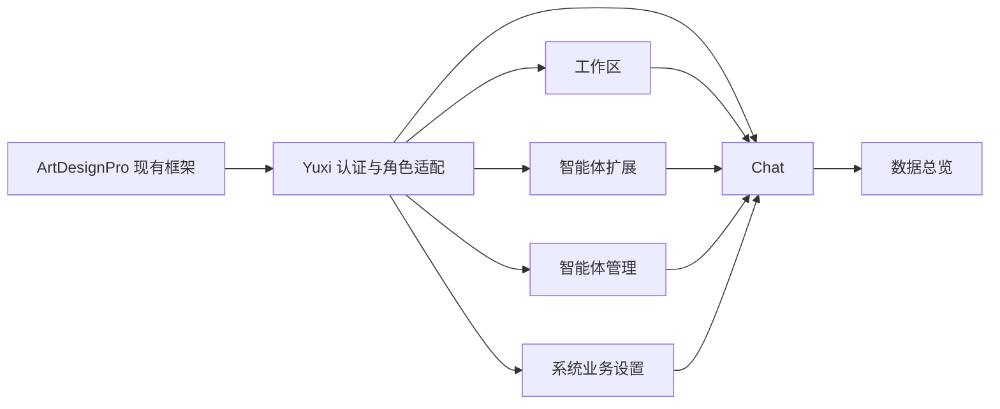

# FoxOps 前端页面完整迁移总方案

## 1. 正确的项目边界

FoxOps 直接基于现有 ArtDesignPro 工程开发。以下框架能力已经存在，必须复用，不从 Yuxi 迁移：

- `App.vue` 与 ArtDesignPro Layout 容器。
- 静态/动态路由注册、模块化路由和路由守卫。
- 菜单、角色权限、按钮权限、工作标签和 keep-alive。
- Header、侧栏、面包屑、全局搜索、快捷入口和通知区域。
- 主题、暗色、布局设置、语言、全局组件和页面高度计算。
- Element Plus 封装、Art 系列组件、ECharts、异常页和登录页视觉骨架。

迁移对象只有 Yuxi 的业务页面、业务组件、业务状态、权限语义和后端接口。不得把 Yuxi `AppLayout.vue` 复制进 FoxOps，也不得另建一套与 ArtDesignPro 竞争的菜单、主题或认证框架。

## 2. 业务页面索引

| 编号 | 业务页面 | Yuxi 基线 | FoxOps 落点 | 方案 |
| --- | --- | --- | --- | --- |
| 01 | 门户首页 | `/` | 复用 `views/index` 或新增业务首页 | [门户首页](./FoxOps%20门户首页完整迁移方案.md) |
| 02 | 登录与首次初始化 | `/login` | 复用 `/auth/login` 页面骨架 | [登录与首次初始化](./FoxOps%20登录与首次初始化页面完整迁移方案.md) |
| 03 | OIDC 回调 | `/auth/oidc/callback` | 新增同路径静态路由 | [OIDC 回调](./FoxOps%20OIDC%20登录回调页面完整迁移方案.md) |
| 04 | CLI 授权 | `/auth/cli/authorize` | 新增同路径静态路由 | [CLI 授权](./FoxOps%20CLI%20授权页面完整迁移方案.md) |
| 05 | Chat 对话 | `/agent/:thread_id?` | 已在 `/chat?thread_id=` 开发 | [Chat 对话](./FoxOps%20Chat%20对话页面完整迁移方案.md) |
| 06 | 工作区 | `/workspace` | 新增 ArtDesignPro 业务路由模块 | [工作区](./FoxOps%20工作区页面完整迁移方案.md) |
| 07 | 智能体扩展 | `/extensions/...` | 新增业务路由及详情子路由 | [智能体扩展](./FoxOps%20智能体扩展页面完整迁移方案.md) |
| 08 | 智能体管理 | `/model-manage` | 新增业务路由模块 | [智能体管理](./FoxOps%20智能体管理页面完整迁移方案.md) |
| 09 | 数据总览 | `/dashboard` | 替换/复用现有 Dashboard 子页 | [数据总览](./FoxOps%20数据总览页面完整迁移方案.md) |
| 10 | 系统设置业务 | Yuxi 设置弹窗 | 复用 `/system` 页面体系 | [系统设置](./FoxOps%20系统设置页面完整迁移方案.md) |
| 11 | 404 内容 | 未知路径 | 复用现有异常页 | [404](./FoxOps%20404%20页面完整迁移方案.md) |

工作区内部的知识库、文件、图谱等视图包含在工作区方案中；知识库、MCP、Skill 详情包含在智能体扩展方案中。ArtDesignPro 框架不是第 12 个迁移页面。

## 3. ArtDesignPro 复用与业务替换表

| ArtDesignPro 已有能力 | 处理方式 | Yuxi 需要接入的内容 |
| --- | --- | --- |
| Layout、侧栏、Header | 原样复用并配置 | FoxOps 品牌、业务菜单 |
| 动态路由模块 | 复用 `router/modules` | Chat、工作区、扩展、智能体管理等业务路由 |
| 路由守卫与菜单权限 | 复用并适配角色 | Yuxi user/admin/superadmin 到现有 role code 的映射 |
| user store/token | 保留结构并适配 API | Yuxi 登录、当前用户、角色、部门字段 |
| 工作标签/keep-alive | 直接复用 | 为每个业务页面配置正确 meta |
| Art Settings Panel | 保留为界面偏好 | 不等同于 Yuxi 业务系统设置 |
| `/system/user` 等模板 | 复用视觉和表格能力 | 替换为 Yuxi 用户、部门、账户、配置 API |
| Dashboard 模板 | 复用卡片与图表组件 | 替换全部 mock/电商指标为 Yuxi 真实统计 |
| 登录页骨架 | 复用布局与主题 | 接入首次初始化、健康检查、锁定、OIDC、协议 |
| 403/404/500 | 复用异常组件 | 替换品牌和跳转文案 |

## 4. 路由和菜单原则

- 业务页继续通过 `foxops-web/src/router/modules` 注册，不另建第二套路由器。
- Chat 保持现有 `/chat`，线程用 query `thread_id`；旧 `/agent/:thread_id` 可做兼容重定向。
- 登录保持 ArtDesignPro `/auth/login`；Yuxi `/login` 可重定向过去。
- OIDC 回调是公开静态路由；CLI 授权是登录后访问的业务路由，需兼容登录 redirect。
- 数据总览可替换 `/dashboard/analysis` 或新增清晰的 Yuxi 子页，不保留无关电商示例为生产菜单。
- 系统业务页面复用 `/system` 分组；Art Settings Panel 只负责主题和布局偏好。
- 发布前从 `routeModules` 和菜单中移除 template、widgets、examples、article、result 等演示入口，但不删除框架源码。

## 5. 权限适配

需要建立唯一角色映射，例如：

- Yuxi `user` → ArtDesignPro 普通业务角色。
- Yuxi `admin` → `R_ADMIN`。
- Yuxi `superadmin` → `R_SUPER`。

最终 code 以当前认证接口和菜单模式为准。菜单隐藏、路由 `roles`、按钮 `authList` 和后端鉴权要一致；前端角色只控制体验，不能替代后端授权。

## 6. API 与状态原则

- 业务 API 统一放入 `foxops-web/src/api`；当前已有 `agent.ts`、`thread.ts`、`mention.ts`、`model.ts` 等继续扩展。
- 继续使用现有 Axios/request、错误处理和 token 注入，不复制 Yuxi `web/src/apis/base.js`。
- Yuxi snake_case 数据在 API/适配层集中转换；组件不同时猜测多种字段。
- Pinia 复用现有 user、agent、chatThreads、chatUI 等 store，新业务只有在确有共享状态时新增 store。
- ArtDesignPro mock 和示例数据不能参与 FoxOps 核心业务验收。

## 7. 推荐实施顺序

### 阶段 A：完成当前 Chat

1. 以当前 Chat 实现为基线补齐路由双向同步、提及、附件语义和状态错误处理。
2. 完成 SSE、审批、恢复、长会话和移动端端到端验证。
3. 不改造 ArtDesignPro 框架。

### 阶段 B：核心业务资源

1. 工作区。
2. 智能体扩展。
3. 智能体管理和模型供应商。
4. 验证这些配置都能回到 Chat 中真实使用。

### 阶段 C：管理业务

1. 在现有 `/system` 页面体系中接入账户、API Key、沙盒变量、用户、部门和系统配置。
2. 用 Yuxi 数据替换现有 Dashboard 示例数据。
3. 完成普通用户、管理员、超级管理员三套权限回归。

### 阶段 D：外围入口与发布清理

1. 将首页、登录、首次初始化、OIDC 和 CLI 授权接入现有视觉骨架。
2. 品牌化异常页。
3. 隐藏演示菜单，完成响应式、暗色、可访问性和 E2E。

## 8. 跨页面依赖

## 9. 总体验收清单

- [ ] 11 个 Yuxi 业务页面单元均有 ArtDesignPro 路由落点。
- [ ] 未复制 Yuxi `AppLayout.vue`，未重建菜单、主题、工作标签或全局路由框架。
- [ ] 现有 ArtDesignPro 权限、request、store、组件和异常处理被复用。
- [ ] Chat、工作区、扩展、智能体管理和系统设置之间数据真实联动。
- [ ] 所有业务主链路使用 Yuxi 后端，不依赖 mock。
- [ ] 三类角色的菜单、路由、按钮和后端权限一致。
- [ ] 示例业务菜单在生产导航中隐藏，但框架基础组件保留。
- [ ] 构建、类型检查、Lint 和关键 E2E 通过。

## 10. 交给其他模型时的规则

每次只提供“本总方案 + 对应页面方案 + Yuxi 原页面路径 + FoxOps 目标目录”。明确告诉实现模型：在 ArtDesignPro 现有框架内开发，不准迁移 Yuxi 外壳，不准重做全局菜单/主题/路由，只对照 Yuxi 补业务功能，并按验收清单逐项报告结果。

