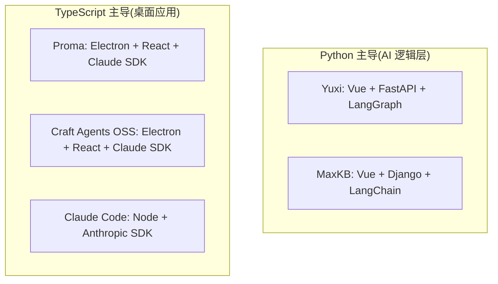
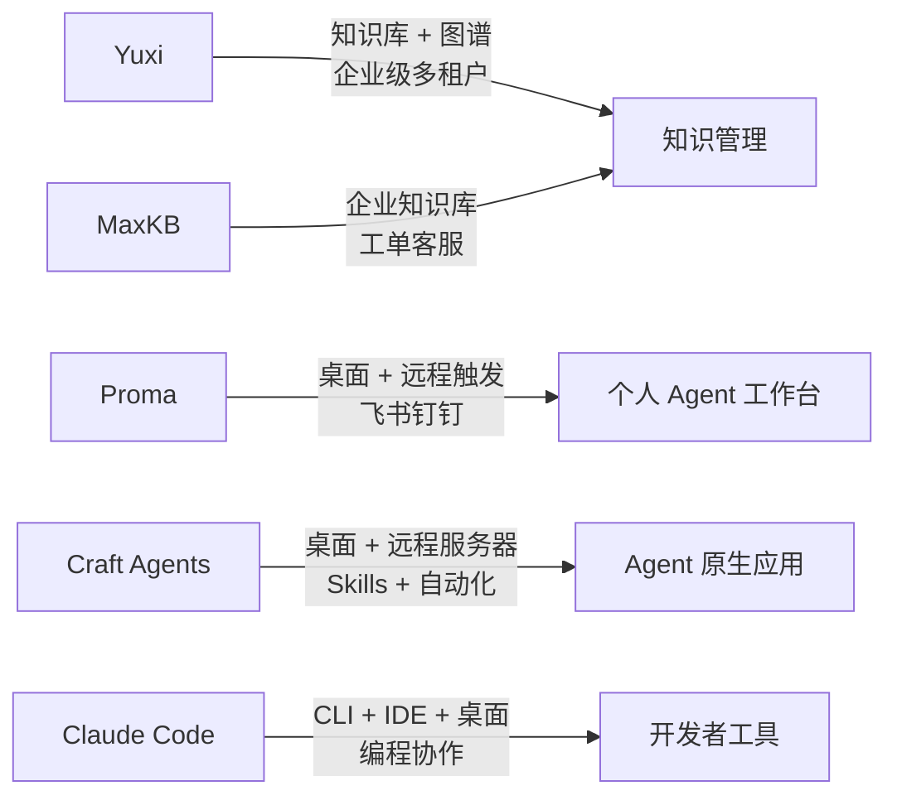
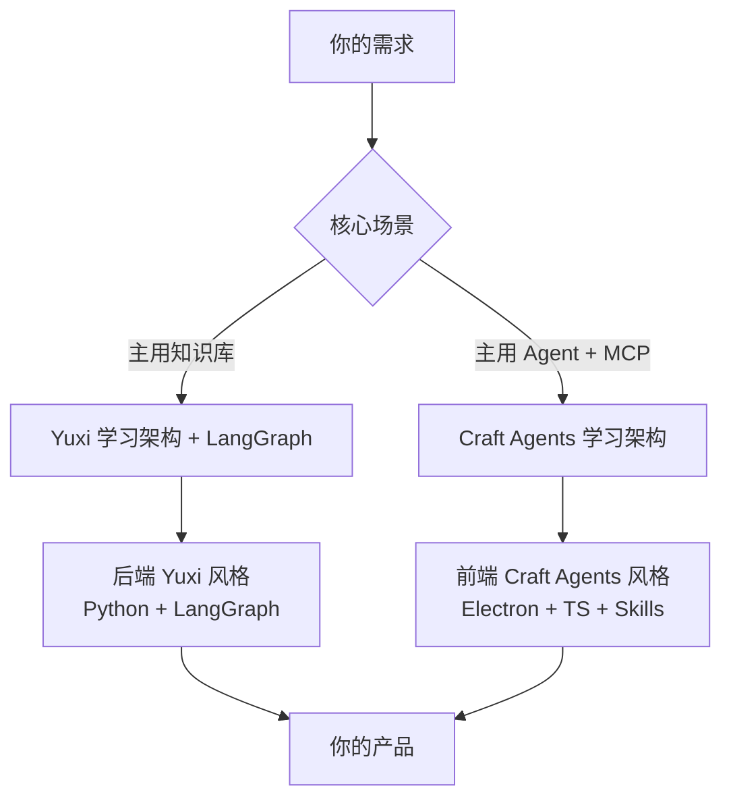

# AI 智能体开源项目对比

> 对比日期:2026 年 7 月 1 日  
> 对比维度:技术栈、支持功能、项目许可证  
> 对比项目:Yuxi(语析)、Proma、Craft Agents OSS、MaxKB、Claude Code

---

## 📊 五项目总览

| 项目 | 仓库地址 | Stars | 类型 | 最新版本 |
|------|---------|-------|------|---------|
| **Yuxi 语析** | `github.com/xerrors/Yuxi` | ⭐ 5.9k | Web 多租户平台(Docker) | v0.7.0(2026.6) |
| **Proma** | `github.com/proma-ai/Proma` | ⭐ 1.4k | 桌面应用(Electron) | v0.13.28(2026.7.1) |
| **Craft Agents OSS** | `github.com/craft-ai-agents/craft-agents-oss` | ⭐ 6.6k | 桌面应用(Electron) | v0.10.4(2026.6) |
| **MaxKB** | `github.com/1Panel-dev/MaxKB` | ⭐ 21.6k | Web 企业平台(Docker) | v2.10.2(2026.6) |
| **Claude Code** | Anthropic 官方 | — | CLI + 桌面 + IDE + Web | 持续更新 |

> **说明**:本对比中"Craft"对应 Craft Agents OSS(craft.do 团队 2026 年开源的版本);Yuxi 的主项目是 `xerrors/Yuxi`(另有一个同名小项目 `wilson0523/Yuxi-Know`,7 stars,功能相近,本次以主项目对比)。

---

## 一、技术栈对比

### 技术栈分类总览

### 详细技术栈对比

| 维度 | Yuxi | Proma | Craft Agents OSS | MaxKB | Claude Code |
|------|------|-------|------------------|-------|-------------|
| **前端框架** | Vue 3 + Vite + Pinia | React 18 + TypeScript | React + TypeScript + shadcn/ui | Vue.js | 各端独立 |
| **后端语言** | **Python** | TypeScript | TypeScript + Python(子进程) | **Python(Django)** | TypeScript(Node) |
| **AI 框架** | **LangGraph** + DeepAgents | Claude Agent SDK | Claude Agent SDK + Pi SDK | **LangChain** | Anthropic SDK |
| **运行时** | Docker Compose | **Bun** + Electron 39 | **Bun** + Electron | Docker | Node.js |
| **数据库** | PostgreSQL + Redis + MinIO | JSON/JSONL(本地文件) | JSON/JSONL + AES-256 加密 | PostgreSQL + pgvector | 云端 |
| **向量库** | **Milvus** + Neo4j(图谱) | 无内置 | 无内置 | **pgvector** | 无 |
| **状态管理** | Pinia | Jotai | React 状态 | Vuex | N/A |
| **构建工具** | Docker | Vite + esbuild | Vite + esbuild | Docker | 各端独立 |
| **包管理** | uv | **Bun** | **Bun** | pip/poetry | npm/pnpm |

### 技术语言分布

| 主语言 | 代表项目 | 典型场景 |
|--------|---------|----------|
| **Python 主导** | Yuxi、MaxKB | 知识库 / RAG / 企业级 |
| **TypeScript 主导** | Proma、Craft Agents、Claude Code | 桌面 Agent / 终端工具 |

---

## 二、支持功能对比

### 功能定位

### 功能详细对比

| 功能 | Yuxi | Proma | Craft Agents OSS | MaxKB | Claude Code |
|------|:----:|:-----:|:----------------:|:-----:|:-----------:|
| **RAG / 知识库** | ✅ Milvus + 图谱 | ❌ 需外接 | ❌ 需外接 | ✅ pgvector | ❌ 需 MCP |
| **知识图谱** | ✅ Neo4j | ❌ | ❌ | ❌ | ❌ |
| **多租户** | ✅ 企业级 | ❌ | ❌ | ✅ 企业版 | ❌ |
| **多模型支持** | ✅ OpenAI 协议 | ✅ 10+ 渠道 | ✅ 5+ Provider | ✅ 全模型 | ❌ 仅 Claude |
| **本地 LLM** | ✅ Ollama/Xinference | ✅ OpenAI 兼容 | ✅ Ollama | ✅ Ollama | ✅ 自定义端点 |
| **Agent 编排** | ✅ LangGraph | ✅ Claude SDK | ✅ Claude + Pi SDK | ✅ 工作流引擎 | ✅ SubAgent |
| **工具调用** | ✅ MCP + 函数库 | ✅ MCP | ✅ MCP | ✅ MCP | ✅ MCP |
| **Skills 系统** | ✅ | ✅ 工作区级别 | ✅ 工作区级别 | ❌ | ✅ 全局 |
| **记忆能力** | ✅ | ✅ 共享记忆 | ✅ Session | ❌ | ✅ CLAUDE.md |
| **多模态** | ✅ 文本/图像/音视频 | ✅ 图片 | ✅ 附件 | ✅ 全模态 | ✅ 图像 |
| **联网搜索** | ❌ 需配置 | ✅ 内置 | ✅ 可配 | ❌ 需配 | ✅ Web 工具 |
| **权限控制** | ✅ 角色权限 | ✅ Agent 权限 | ✅ 三级模式 | ✅ RBAC | ✅ 自动批准 |
| **后台任务** | ✅ ARQ Worker | ✅ Background | ✅ Background | ✅ 工作流 | ✅ Routines |
| **远程触发** | ❌ | ✅ 飞书/钉钉/微信 | ❌ | ❌ | ✅ Slack/IM |
| **桌面应用** | ❌ | ✅ 原生支持 | ✅ 原生支持 | ❌ | ✅ 2026 新增 |
| **Web UI** | ✅ | ✅ | ✅ | ✅ | ✅ |
| **CLI** | ❌ | ❌ | ✅ 内置 | ❌ | ✅ 原生 |
| **IDE 插件** | ❌ | ❌ | ❌ | ❌ | ✅ VS Code/JetBrains |
| **远程服务器** | ❌ | ❌ | ✅ Headless | ❌ | ✅ Web 版 |
| **自动化** | ❌ | ❌ | ✅ 事件驱动 | ❌ | ✅ 计划任务 |
| **多会话管理** | ✅ | ✅ | ✅ 收件箱 | ✅ | ✅ |

---

## 三、项目许可证对比

### 许可证总览

| 项目 | 许可证 | 是否可商用 | 传染性 | 二次开发要求 |
|------|--------|:----------:|:------:|-------------|
| **Yuxi 语析** | **MIT** | ✅ 完全自由 | 🟢 无 | 保留版权即可 |
| **Proma** | **AGPL-3.0** | ⚠️ 有条件 | 🔴 强 | 网络服务也须开源 |
| **Craft Agents OSS** | **Apache-2.0** | ✅ 完全自由 | 🟢 无 | 保留版权 + 专利授权 |
| **MaxKB** | **GPL-3.0** | ⚠️ 有条件 | 🔴 强 | 衍生作品须 GPL |
| **Claude Code** | **专有(Anthropic)** | ❌ 订阅制 | — | 不可二次分发 |

### 许可证兼容性矩阵

| 许可证 | 使用自由度 | 可商用 | 注意事项 |
|--------|:---------:|--------|----------|
| **MIT** | ⭐⭐⭐⭐⭐ | ✅ 完全允许 | 最宽松,仅需保留版权声明 |
| **Apache-2.0** | ⭐⭐⭐⭐⭐ | ✅ 完全允许 | 需保留版权 + 专利授权声明 |
| **GPL-3.0** | ⭐⭐ | ⚠️ 衍生作品须开源 | 传染性强,改动后必须 GPL |
| **AGPL-3.0** | ⭐⭐ | ⚠️ SaaS 也须开源 | 比 GPL 更严,网络服务也要公开源码 |
| **专有(Anthropic)** | ⭐ | ❌ 订阅付费 | 不可二次分发、不可商业集成 |

---

## 四、综合评分与定位

| 项目 | 知识库 | Agent 能力 | 桌面体验 | 许可证 | 综合 |
|------|:------:|:----------:|:--------:|:------:|:----:|
| **Yuxi 语析** | ⭐⭐⭐⭐⭐ | ⭐⭐⭐⭐ | ⭐ | ⭐⭐⭐⭐⭐ | 3.8 |
| **Proma** | ⭐ | ⭐⭐⭐⭐⭐ | ⭐⭐⭐⭐⭐ | ⭐⭐ | 3.3 |
| **Craft Agents OSS** | ⭐⭐ | ⭐⭐⭐⭐⭐ | ⭐⭐⭐⭐⭐ | ⭐⭐⭐⭐⭐ | **4.3** |
| **MaxKB** | ⭐⭐⭐⭐⭐ | ⭐⭐⭐⭐ | ⭐ | ⭐⭐ | 3.0 |
| **Claude Code** | ⭐⭐ | ⭐⭐⭐⭐⭐ | ⭐⭐⭐⭐ | ⭐ | 3.0 |

---

## 五、针对你的项目建议

> 你的项目:桌面端 AI 智能体应用,后端 Python + LangChain + LlamaIndex,需要集成知识库。

### 推荐学习路径

| 优先级 | 学习项目 | 重点学习内容 |
|:------:|----------|-------------|
| ⭐⭐⭐ | **Yuxi 语析** | LangGraph 多智能体、知识图谱、MinerU 文档解析(你最缺的**知识库 + Agent 整合方案**) |
| ⭐⭐⭐ | **Craft Agents OSS** | Electron + React 桌面架构、Skills 系统、Claude Agent SDK 集成 |
| ⭐⭐ | **MaxKB** | LangChain + pgvector 的 RAG 流水线(快速搭建参考) |
| ⭐⭐ | **Proma** | 国内渠道适配(飞书/钉钉/微信桥接)、Bun + Electron 工程化 |
| ⭐ | **Claude Code** | 终端 UX 设计、SubAgent 编排思路 |

### 推荐架构组合

### ⚠️ 避坑提醒

| 项目 | 避坑点 |
|------|--------|
| **MaxKB(GPL-3.0)** | 如果你要做商业闭源产品,**不能直接基于它二次开发**,需要重写或购买商业授权 |
| **Proma(AGPL-3.0)** | 同样强传染,SaaS 服务会被强制要求开源;适合自用,商业化需联系 erlichliu@gmail.com |
| **Claude Code** | 不是开源项目,只可作为产品参考,**不能 fork 修改后商用** |
| **Yuxi / Craft Agents** | MIT / Apache-2.0 都是**最宽松**的许可证,商业项目首选 ✅ |

---

## 六、参考资料

- [Yuxi 语析 GitHub](https://github.com/xerrors/Yuxi)
- [Proma GitHub](https://github.com/proma-ai/Proma)
- [Craft Agents OSS GitHub](https://github.com/craft-ai-agents/craft-agents-oss)
- [MaxKB GitHub](https://github.com/1Panel-dev/MaxKB)
- [Claude Code 官方文档](https://code.claude.com/docs/en/overview)

---

*本文档由 Craft Agent 协助生成 · 2026.7.1*